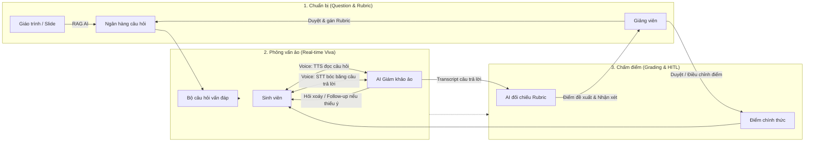

# AIVES: AI-Powered Viva Exam System
> **Tên dự án**: Hệ Thống Thi Vấn Đáp Thông Minh Ứng Dụng AI  
> **Tên viết tắt**: **AIVES** (AI-powered Viva Exam System)  
> **Mục tiêu tài liệu**: Giới thiệu bức tranh tổng quan toàn diện, ngắn gọn, súc tích dành cho Developer, Solution Architect và AI Agents.

---

## 1. Bài toán thực tế (Problem Statement)
Thi vấn đáp (Viva / Oral Exam) là hình thức đánh giá năng lực rất thực chất trong giáo dục đại học (bảo vệ đồ án, phỏng vấn chuyên môn). Tuy nhiên, phương pháp truyền thống gặp các nút thắt lớn:
1. **Tốn nhân lực & thời gian**: Giảng viên phải ngồi phỏng vấn từng sinh viên, khó mở rộng quy mô.
2. **Khó chuẩn hóa**: Độ khó giữa các lượt hỏi không đồng đều; câu hỏi tùy hứng, thiếu bám sát rubric chuẩn.
3. **Thiếu cơ sở đánh giá chi tiết**: Điểm số thường mang tính cảm tính, thiếu phân tích cụ thể từng ý trả lời theo rubric.

---

## 2. AIVES là gì? (Product Vision)
**AIVES** là nền tảng phỏng vấn vấn đáp kết hợp giữa **Voice AI (STT/TTS)** và **Mô hình ngôn ngữ lớn (LLM)** hoạt động dưới vai trò **"Giám khảo ảo thông minh"**, với sự kiểm soát và phê duyệt của giảng viên (**Human-in-the-Loop**).

### Giá trị cốt lõi (Core Value Proposition)
- **Tự động sinh đề & Rubric (RAG)**: AI đọc giáo trình/slide môn học để gợi ý câu hỏi đa dạng theo thang đo Bloom kèm rubric chấm điểm.
- **Phỏng vấn thích ứng (Adaptive Follow-up)**: Điểm khác biệt cốt lõi — AI nghe câu trả lời của sinh viên để **hỏi xoáy, yêu cầu giải thích rõ hoặc chất vấn khi phát hiện mâu thuẫn/thiếu ý**.
- **Chấm điểm gợi ý minh bạch**: AI đối chiếu transcript câu trả lời với tiêu chí Rubric để xuất điểm chi tiết kèm bằng chứng (câu nào đúng, ý nào còn thiếu).
- **Giảng viên luôn là người quyết định cuối (HITL)**: Giảng viên xem transcript, điểm AI đề xuất và toàn quyền phê duyệt/điều chỉnh điểm.

---

## 3. Quy trình hoạt động tinh gọn (End-to-End Workflow)

---

## 4. Các vai trò chính trong hệ thống (User Roles)

| Vai trò | Mô tả | Trải nghiệm chính trên hệ thống |
| :--- | :--- | :--- |
| **Sinh viên (Thí sinh)** | Thí sinh tham gia phỏng vấn | - Kiểm tra âm thanh (mic/loa). - Tương tác giọng nói trực tiếp với AI trong phòng thi ảo. - Xem báo cáo chi tiết: điểm từng câu, transcript và nhận xét sau khi giảng viên duyệt. |
| **Giảng viên** | Người quản lý chuyên môn & chốt điểm | - Quản lý, biên tập và duyệt ngân hàng câu hỏi + Rubric (tự tạo hoặc AI RAG sinh ra). - Xem transcript chi tiết buổi vấn đáp của sinh viên. - Xem điểm AI đề xuất, điều chỉnh và chốt điểm chính thức (Human-in-the-Loop). |
| **Quản trị viên (Admin)** | Quản lý hệ thống | - Phân quyền tài khoản giảng viên theo môn học. - Cấu hình endpoint AI (OpenAI/Anthropic/Whisper/TTS). - Cấu hình ngôn ngữ hệ thống. |

---

## 5. Các module chức năng trọng tâm (Core Modules)

1. **Module 1: Quản lý ngân hàng câu hỏi & Rubric (RAG-based Question Bank)**:
   - Tải lên giáo trình/slide môn học để AI trích xuất nội dung (RAG).
   - AI sinh câu hỏi theo 4 mức độ tư duy Bloom (Nhớ, Hiểu, Vận dụng, Phân tích).
   - Thiết lập Rubric chấm điểm chi tiết (tiêu chí, trọng số %).
   - Giảng viên kiểm duyệt, chỉnh sửa hoặc tạo câu hỏi thủ công.

2. **Module 3: Điều phối phỏng vấn ảo thời gian thực (Real-time Viva Orchestrator via Cloud APIs)**:
   - Đọc câu hỏi bằng giọng nói tự nhiên (TTS).
   - Thu âm và chuyển giọng nói thành văn bản thời gian thực (STT).
   - Lõi phỏng vấn thích ứng: phân tích câu trả lời và tự động hỏi đào sâu (Follow-up) theo ngữ cảnh khi sinh viên trả lời thiếu ý, mơ hồ hoặc mâu thuẫn.
   - Kiểm soát thời gian trả lời và số lượt hỏi xoáy tối đa mỗi câu.

3. **Module 4: Hỗ trợ chấm điểm bằng AI (AI Scoring & HITL Review)**:
   - Tự động đối chiếu transcript câu trả lời với các tiêu chí trong Rubric.
   - Sinh điểm đề xuất kèm nhận xét minh bạch (chỉ ra điểm mạnh, điểm yếu, các ý còn thiếu).
   - Giao diện thẩm định cho giảng viên: xem toàn bộ transcript, điểm gợi ý của AI, cho phép ghi đè điểm và chốt điểm cuối cùng.

---

## 6. Ranh giới hệ thống: Điều hệ thống LÀM và KHÔNG LÀM

| Hệ thống LÀM (In-Scope) | Hệ thống KHÔNG LÀM (Out-of-Scope) |
| :--- | :--- |
| Tương tác giọng nói và hỏi xoáy thích ứng theo ngữ cảnh thời gian thực. | Không tự động chốt và công bố điểm chính thức nếu chưa có giảng viên duyệt. |
| Sinh câu hỏi từ tài liệu môn học có thẩm định của giảng viên. | Không thay thế hoàn toàn vai trò chuyên môn của giảng viên. |
| Đối chiếu transcript với rubric để đưa ra gợi ý chấm điểm chi tiết. | Không quản lý phức tạp việc xếp lịch thi/phòng thi phân tán và hệ thống khiếu nại phúc khảo tự động. |
