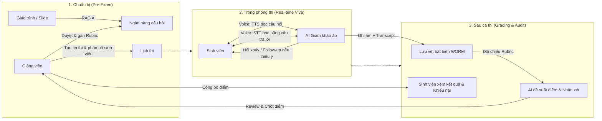

# AIVES: AI-Powered Viva Exam System
> **Tên dự án**: Hệ Thống Thi Vấn Đáp Thông Minh Ứng Dụng AI  
> **Tên viết tắt**: **AIVES** (AI-powered Viva Exam System)  
> **Mục tiêu tài liệu**: Giới thiệu bức tranh tổng quan toàn diện, ngắn gọn, súc tích dành cho Developer, Solution Architect và AI Agents.

---

## 1. Bài toán thực tế (Problem Statement)
Thi vấn đáp (Viva / Oral Exam) là hình thức đánh giá năng lực rất thực chất trong giáo dục đại học (đặc biệt là bảo vệ đồ án tốt nghiệp, thi thực hành, phỏng vấn chuyên môn). Tuy nhiên, phương pháp truyền thống gặp các nút thắt lớn:
1. **Tốn nhân lực & thời gian**: Giảng viên phải ngồi phỏng vấn từng sinh viên (15-30 phút/bạn), khó triển khai cho lớp đông (vài trăm sinh viên).
2. **Khó chuẩn hóa**: Độ khó giữa các phòng thi/giám khảo không đồng đều; câu hỏi tùy hứng, thiếu bám sát rubric chuẩn.
3. **Thiếu bằng chứng đối soát**: Khi sinh viên khiếu nại điểm, thường chỉ có điểm số chung cuộc trên giấy mà thiếu bản ghi chi tiết (transcript lời nói, thời gian phản xạ, rubric chi tiết từng câu).

---

## 2. AIVES là gì? (Product Vision)
**AIVES** là nền tảng tổ chức thi vấn đáp tự động hóa kết hợp giữa **Voice AI (STT/TTS)** và **Mô hình ngôn ngữ lớn (LLM)** hoạt động dưới vai trò **"Giám khảo ảo thông minh"**, với sự giám sát và phê duyệt tối cao của giảng viên (**Human-in-the-Loop**).

### Giá trị cốt lõi (Core Value Proposition)
- **Tự động sinh đề & Rubric (RAG)**: AI đọc giáo trình/slide môn học để gợi ý câu hỏi đa dạng theo thang đo Bloom kèm rubric chấm điểm.
- **Phỏng vấn thích ứng (Adaptive Follow-up)**: Điểm khác biệt lớn nhất — AI không chỉ đọc câu hỏi tĩnh, mà có khả năng **nghe câu trả lời của sinh viên để hỏi xoáy, yêu cầu giải thích rõ hoặc chất vấn khi phát hiện mâu thuẫn**.
- **Chấm điểm gợi ý minh bạch**: AI đối chiếu transcript câu trả lời với tiêu chí Rubric để xuất điểm chi tiết kèm bằng chứng (câu nào đúng, ý nào còn thiếu).
- **Giảng viên luôn là trọng tài cuối (HITL)**: Giảng viên xem lại toàn bộ transcript, bằng chứng ghi âm và có toàn quyền chỉnh sửa điểm trước khi công bố.

---

## 3. Hệ thống hoạt động như thế nào? (End-to-End Workflow)

---

## 4. Các vai trò chính trong hệ thống (User Roles)

| Vai trò | Mô tả | Trải nghiệm chính trên hệ thống |
| :--- | :--- | :--- |
| **Sinh viên (Thí sinh)** | Đối tượng được đánh giá năng lực | - Kiểm tra âm thanh (mic/loa) trước giờ thi. - Tương tác giọng nói trực tiếp với AI trong phòng thi ảo. - Xem báo cáo chi tiết: điểm từng câu, transcript và nhận xét sau khi giảng viên duyệt. |
| **Giảng viên** | Người ra đề, coi thi và quyết định điểm | - Duyệt ngân hàng câu hỏi AI sinh ra từ tài liệu môn học. - Lập lịch thi, cài đặt quy chế (thời gian trả lời, số lần hỏi xoáy tối đa). - Theo dõi phòng thi trực tiếp. - Xem transcript, nghe lại audio và chốt điểm cuối cùng. |
| **Quản trị viên (Admin)** | Quản lý hệ thống | - Phân quyền tài khoản giảng viên theo môn học. - Cấu hình endpoint AI (OpenAI/Anthropic/Whisper/TTS). - Giám sát tài nguyên hệ thống và chính sách lưu trữ dữ liệu. |

---

## 5. Các module chức năng chính (Functional Modules)

1. **Module 1: Quản lý ngân hàng câu hỏi & Rubric (RAG-based Question Bank)**:
   - Tải lên giáo trình/slide môn học.
   - AI sinh câu hỏi theo 4 mức độ tư duy Bloom (Nhớ, Hiểu, Vận dụng, Phân tích).
   - Thiết lập Rubric chấm điểm chi tiết (tiêu chí, trọng số %).

2. **Module 2: Quản lý kỳ thi & Lịch thi (Exam Scheduling & Allocation)**:
   - Cấu hình ca thi, giới hạn thời gian trả lời mỗi câu.
   - Thuật toán bốc đề ngẫu nhiên, chống trùng câu hỏi giữa các thí sinh thi gần giờ nhau.

3. **Module 3: Lõi phỏng vấn ảo AI (Real-time Viva Interview Engine)**:
   - Đọc câu hỏi bằng giọng nói tự nhiên (TTS).
   - Thu âm và chuyển giọng nói thành văn bản thời gian thực (STT).
   - Logic phỏng vấn thích ứng: phân tích câu trả lời và tự động hỏi đào sâu (Follow-up) theo ngữ cảnh.

4. **Module 4: Hỗ trợ chấm điểm (AI Scoring & HITL Review)**:
   - Tự động map transcript với Rubric để xuất điểm số và nhận xét chi tiết (điểm mạnh, ý thiếu).
   - Bảng điều khiển cho giảng viên duyệt điểm, sửa điểm và ghi chú.

5. **Module 5: Lưu vết & Giải quyết khiếu nại (Audit & Evidence)**:
   - Lưu trữ toàn bộ audio/video và log dòng thời gian bất biến.
   - Giao diện đối soát đồng bộ giữa âm thanh (waveform) và văn bản transcript khi sinh viên phúc khảo.

---

## 6. Ranh giới hệ thống: Điều hệ thống LÀM và KHÔNG LÀM

| Hệ thống LÀM (In-Scope) | Hệ thống KHÔNG LÀM (Out-of-Scope) |
| :--- | :--- |
| Trả lời và hỏi xoáy thích ứng theo giọng nói thời gian thực. | Không tự động chốt điểm chính thức bỏ qua giảng viên (tránh rủi ro pháp lý). |
| Sinh câu hỏi từ tài liệu môn học có thẩm định của giảng viên. | Không thay thế hoàn toàn vai trò của giảng viên trong đào tạo. |
| Lưu vết đầy đủ audio, transcript, thời gian phản xạ để chống gian lận/khiếu nại. | Không cố gắng can thiệp sâu vào các kỳ thi viết luận tự luận dài dạng bài tập lớn. |
