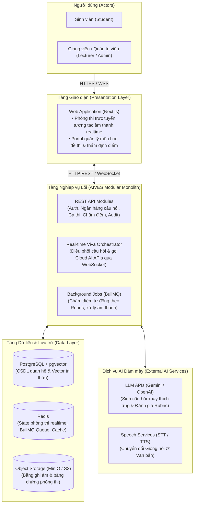
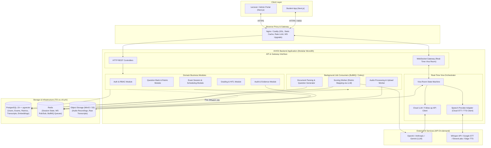
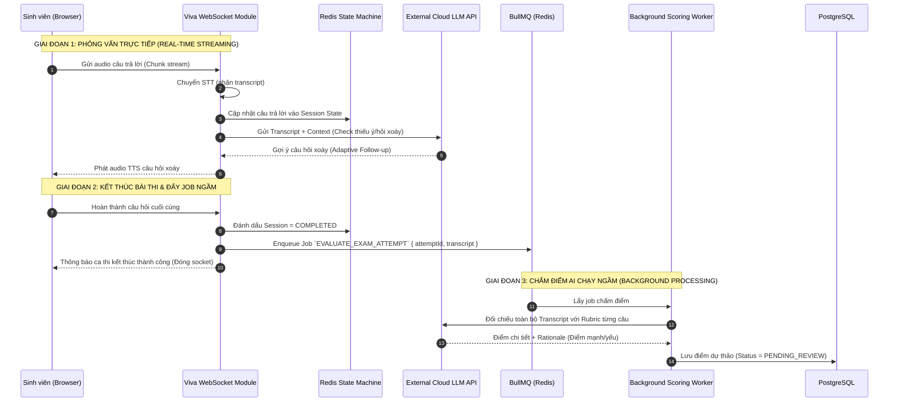

# Modular Monolith Software Architecture Specification: AIVES

**System**: AI-powered Viva Exam System (AIVES)  
**Target Audience**: Dev, AI Agent, Solution Architect  
**Design Philosophy**: Modular Monolith with In-Process/Redis Job Queue, Real-Time Streaming, Low Infrastructure Cost, High Maintainability, Human-in-the-Loop (HITL).

---

## 1. Kiến trúc Hệ thống (System Architecture Overview)

### 1.1. Sơ đồ Kiến trúc Tổng quan (High-Level Architecture)

Nhìn ở góc độ tổng thể cấp cao, kiến trúc hệ thống **AIVES** được tổ chức thành các tầng rõ ràng, tinh gọn, tối ưu chi phí hạ tầng nhưng vẫn đảm bảo tính module hóa cao và khả năng xử lý thời gian thực:



---

### 1.2. Sơ đồ Topology & Thành phần Chi tiết (Detailed Architectural Topology)

Chi tiết cấu trúc bên trong ứng dụng **Modular Monolith** kết hợp **Background Job Queue (BullMQ / Celery)** và **WebSocket Gateway**:



---

## 2. Technology Stack (Tối ưu hóa Chi phí & Độ trễ)

| Tầng (Layer)                  | Công nghệ đề xuất                                                                                                                  | Lý do & Tối ưu chi phí                                                                                                                                                                                             |
| :---------------------------- | :--------------------------------------------------------------------------------------------------------------------------------- | :----------------------------------------------------------------------------------------------------------------------------------------------------------------------------------------------------------------- |
| **Frontend**                  | **Next.js 14+ (App Router, TypeScript), TailwindCSS, Zustand**                                                                     | 1 codebase chung cho cả Portal giảng viên và Phòng thi sinh viên. Sử dụng Web Audio API & MediaRecorder ghi âm trực tiếp tại client.                                                                               |
| **Reverse Proxy**             | **Nginx hoặc Caddy**                                                                                                               | Cực nhẹ, miễn phí, tự động cấp SSL Let's Encrypt, xử lý WebSocket upgrade và forward traffic vào Monolith.                                                                                                         |
| **Backend Framework**         | **NestJS (Node.js/TS)** hoặc **FastAPI (Python)**                                                                                  | - **NestJS**: Kiến trúc Module mạnh nhất trong Node.js, chia boundary sạch sẽ, tích hợp sẵn WebSocket & BullMQ.<br>- **FastAPI**: Lựa chọn số 1 nếu muốn chạy AI agent/LangGraph cùng chung runtime Python.        |
| **Database (All-in-One)**     | **PostgreSQL (v15+) + `pgvector`**                                                                                                 | Đóng vai trò vừa là CSDL quan hệ chính (User, Exam, Rubric, Grade) vừa là Vector DB lưu embedding giáo trình (không tốn tiền mua dịch vụ Vector DB riêng như Pinecone/Milvus).                                     |
| **Cache & Message Broker**    | **Redis (In-Memory)**                                                                                                              | Đảm nhiệm 3 việc cùng lúc trên 1 instance:<br>1. Cache phiên thi & Distributed Lock.<br>2. Lưu State Machine phòng thi realtime.<br>3. Làm Queue cho **BullMQ** chạy job ngầm (không cần dựng Kafka hay RabbitMQ). |
| **Background Processing**     | **BullMQ (Node.js) / Celery (Python)**                                                                                             | Xử lý bất đồng bộ các tác vụ nặng: bóc băng hoàn chỉnh, AI đối chiếu Rubric chấm điểm, mã hóa file audio.                                                                                                          |
| **Speech Pipeline (STT/TTS)** | - **Client/Edge**: Web Speech API / Edge-TTS (Miễn phí).<br>- **Cloud Fallback**: OpenAI Whisper API / Google Speech / Kokoro TTS. | Giảm tải máy chủ: client có thể tận dụng STT trình duyệt cho bản nháp, chỉ dùng API cloud khi cần chính xác cao.                                                                                                   |
| **LLM Inference**             | **Gemini 1.5 Flash / GPT-4o-mini**                                                                                                 | Giá token cực rẻ ($0.075 - $0.15 / 1M token), độ trễ phản hồi thấp ($< 1s$), hoàn hảo cho adaptive follow-up và chấm rubric.                                                                                       |
| **Object Storage**            | **MinIO (Self-hosted trên VPS) hoặc Cloudflare R2 / AWS S3**                                                                       | MinIO miễn phí hoàn toàn nếu tự host trên cùng VPS; hoặc dùng Cloudflare R2 không tính phí băng thông tải (egress free).                                                                                           |

---

## 3. Cấu trúc Module trong Codebase (Modular Structure)

Mỗi module tuân thủ nguyên tắc **đóng gói nội bộ (Encapsulation)**, chỉ giao tiếp qua Service Interface công khai, không query chéo bảng CSDL của module khác:

```
src/
├── app.module.ts                   # Root Module liên kết các Sub-modules
├── common/                         # DTO, Guards, Filters, Interceptors dùng chung
│   ├── decorators/
│   ├── guards/                     # JwtAuthGuard, RolesGuard
│   └── interceptors/
├── modules/
│   ├── auth/                       # Module: Xác thực & Phân quyền (BR-AUTH)
│   ├── question-bank/              # Module: Ngân hàng câu hỏi, RAG & Rubric (BR-BANK)
│   ├── exam-session/               # Module: Tạo đợt thi, bốc đề chống trùng (BR-SESSION)
│   ├── viva-room/                  # Module: WebSocket Gateway, State Machine thời gian thực (BR-VIVA)
│   ├── grading/                    # Module: Scoring (Cloud LLM API) & Human-in-the-Loop Review (BR-GRADE)
│   └── audit-evidence/             # Module: Ghi âm, Transcript bất biến, Khiếu nại (BR-AUDIT)
├── jobs/                           # Background Workers (BullMQ)
│   ├── scoring.processor.ts        # Worker chấm điểm AI ngầm sau khi kết thúc ca thi
│   └── audio-upload.processor.ts   # Worker nén và đẩy audio lên Object Storage
└── providers/                      # Tầng tích hợp dịch vụ ngoài (Adapters)
    ├── ai/                         # LangChain / OpenAI / Gemini client
    ├── speech/                     # STT / TTS service clients
    └── storage/                    # S3 / MinIO adapter
```

---

## 4. Quy trình Real-Time Viva & Xử lý Bất đồng bộ (Streaming & Async Flow)



---

## 5. Các mẫu thiết kế then chốt (Key Design Patterns)

1. **Human-in-the-Loop (HITL) CQRS Pattern**:
   - Tách biệt trạng thái điểm: `AI_DRAFT` (lưu ngầm trong DB) $\rightarrow$ Giảng viên vào màn hình thẩm định chốt điểm $\rightarrow$ Cập nhật thành `PUBLISHED`. Sinh viên không bao giờ đọc trực tiếp điểm số khi chưa có cờ `PUBLISHED`.
2. **State Machine phòng thi (FSM)**:
   - Toàn bộ trạng thái câu hỏi (`ANNOUNCED` $\rightarrow$ `THINKING` $\rightarrow$ `ANSWERING` $\rightarrow$ `EVALUATING` $\rightarrow$ `NEXT`) được kiểm soát trên Redis. Ngăn chặn gian lận tua nhanh thời gian hoặc gửi request sai thứ tự từ client.
3. **Outbox Pattern / Background Dispatching**:
   - Khi ca thi kết thúc, lưu ngay bản ghi vào DB và bắn job vào BullMQ trong cùng 1 transaction/luồng, đảm bảo không bao giờ thất lạc bài thi dù server có bị restart đột ngột.

---

## 6. Ưu điểm nổi bật của kiến trúc Modular Monolith cho dự án này

- 💰 **Chi phí cực thấp**: Toàn bộ hệ thống (Frontend + Backend + Postgres + Redis + MinIO) có thể đóng gói bằng `docker-compose` và chạy mượt mà trên **1 VPS duy nhất (4 vCPU, 8GB RAM)** với chi phí khoảng **$15 - $20 / tháng**.
- 🚀 **Tốc độ phát triển nhanh**: Nhóm dev chia việc theo từng thư mục `modules/`, dùng chung schema TypeScript/ORM, không tốn thời gian cấu hình DevOps mạng phức tạp giữa các microservice.
- 🛡️ **Khả năng mở rộng trong tương lai (Evolutionary Architecture)**: Do các module đã phân tách ranh giới rõ ràng, khi hệ thống đạt quy mô hàng chục nghìn sinh viên, ta hoàn toàn có thể bóc riêng `viva-room` hoặc `scoring-worker` thành service độc lập mà không cần viết lại mã nguồn nghiệp vụ.
