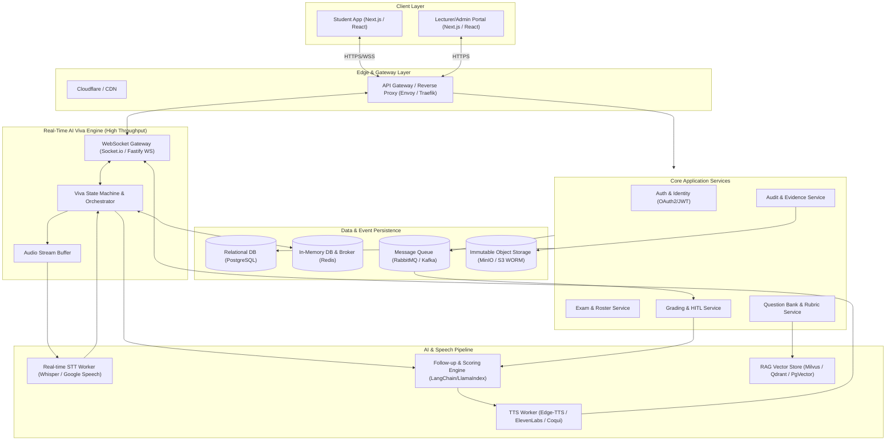
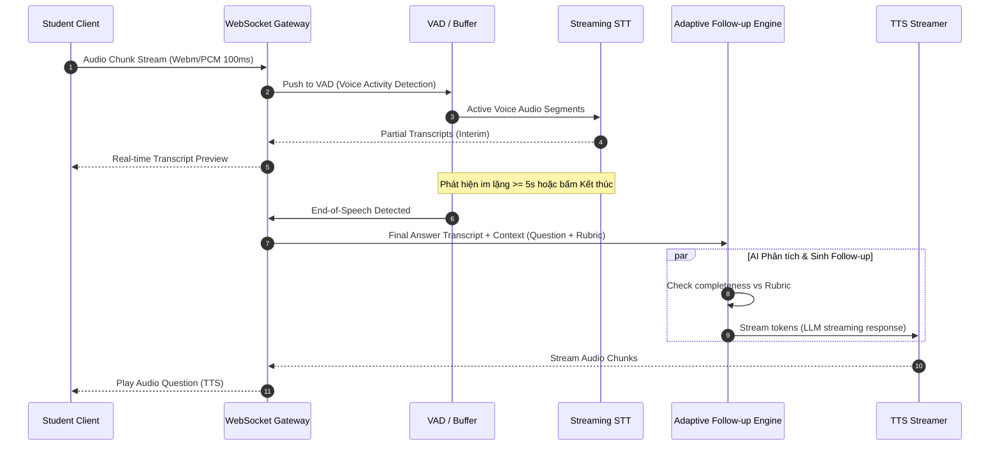

# Modern Software Architecture Specification: AIVES
**System**: AI-powered Viva Exam System (AIVES)  
**Target Audience**: Dev, AI Agent, Solution Architect  
**Design Philosophy**: Event-Driven, Real-Time Streaming, Modular Monolith / Microservices-Ready, Resilient AI Integration (HITL).

---

## 1. Architectural Topology Overview

Hệ thống kết hợp giữa **Sync/Async Core API (Modular)** và **Real-Time Streaming Engine (WebSocket/WebRTC)** nhằm đảm bảo SLA độ trễ ($\le 3s$) khi vấn đáp trực tiếp:

---

## 2. Technology Stack Recommendation

| Tầng (Layer) | Công nghệ đề xuất | Lý do kỹ thuật |
| :--- | :--- | :--- |
| **Frontend** | **Next.js 14+ (App Router), TypeScript, TailwindCSS, Zustand / TanStack Query** | Hỗ trợ SSR cho Dashboard, SPA tối ưu cho Real-time Viva Room qua Web Audio API & MediaRecorder. |
| **API Gateway** | **Traefik / Nginx / NestJS Gateway** | Rate limiting, WebSocket upgrade management, SSL termination. |
| **Backend Core** | **Node.js (NestJS) hoặc Golang** | - **NestJS**: Kiến trúc Module rõ ràng, DI mạnh mẽ, cực hợp DDD. - **Golang**: Tối ưu tuyệt đối nếu cần xử lý streaming audio raw socket với độ trễ siêu thấp. |
| **AI Orchestration** | **Python (FastAPI + LangGraph / LlamaIndex)** | Hệ sinh thái AI tốt nhất, LangGraph xử lý cực mạnh đồ thị hội thoại (Adaptive Follow-up state machine). |
| **Speech Pipeline** | - **STT**: OpenAI Whisper v3 (Self-hosted via vLLM/Faster-Whisper) hoặc Google Speech API. - **TTS**: Kokoro TTS / Edge-TTS / ElevenLabs. | Tối ưu độ trễ và khả năng nhận diện tiếng Việt chuyên ngành. |
| **Database (OLTP)** | **PostgreSQL (v15+)** | Schema quan hệ chặt chẽ cho đề thi, sinh viên, rubric, điểm số; tích hợp `pgvector` cho RAG câu hỏi. |
| **Cache & State** | **Redis (Cluster / Sentinel)** | Lưu phiên thi active, ephemeral state machine, Pub/Sub tín hiệu realtime, Distributed Lock. |
| **Message Queue** | **RabbitMQ / Apache Kafka** | Xử lý bất đồng bộ các tác vụ nặng: bóc băng hoàn chỉnh, AI chấm điểm Rubric, convert/compress video audio. |
| **Object Storage** | **MinIO / AWS S3 (WORM Object Lock)** | Lưu audio/video bản ghi và raw transcript, tuân thủ quy tắc bất biến chống sửa xóa. |

---

## 3. Real-Time Viva Streaming Architecture (Core Latency Engine)

Điểm then chốt nhất của hệ thống là **độ trễ phản hồi viva $\le 3000\text{ ms}$**. Kiến trúc xử lý luồng (Streaming Pipeline):

---

## 4. Key Architectural Patterns

### 4.1. Human-in-the-Loop (HITL) CQRS Pattern
- **Command**: AI sinh đề xuất điểm $\rightarrow$ ghi vào `ScoreDraft` (chưa public).
- **Query**: Sinh viên chỉ query được từ `PublishedScoresView`.
- **Lecturer Action**: Giảng viên thực hiện Command `ReviewAndPublishExamScore`, commit sự kiện `ScoreApprovedEvent` để publish điểm chính thức.

### 4.2. Finite State Machine (FSM) cho Viva Session
- Trạng thái từng câu hỏi và toàn phiên thi được quản lý bằng FSM trên Redis:
  - `INIT` $\rightarrow$ `QUESTION_ANNOUNCED` $\rightarrow$ `THINKING` $\rightarrow$ `ANSWERING` $\rightarrow$ `EVALUATING` $\rightarrow$ `FOLLOW_UP_TRIGGERED` / `NEXT_QUESTION` $\rightarrow$ `FINISHED`.
- Mọi action gửi từ Client bắt buộc phải khớp với State hiện tại của FSM (ngăn chặn hành vi can thiệp DOM/API).

### 4.3. WORM Audit Trail Pattern (Write Once, Read Many)
- Mọi lượt thi sinh ra một `SessionAuditEnvelope` gồm: `SHA-256(Audio)` + `SHA-256(Transcript)` + `ScoringLogs`.
- Ghi trực tiếp vào Object Storage với header `Object-Lock: Retention`.

---

## 5. Non-Functional Architecture (SLA, Scalability & Security)

1. **High Availability (HA)**:
   - Stateless WebSocket Nodes đằng sau Layer 4/7 Load Balancer, sticky-session hoặc đồng bộ state qua Redis Pub/Sub.
2. **Graceful Degradation**:
   - Khi mạng sinh viên yếu: Tự động hạ bitrate audio từ 64kbps xuống 16kbps Opus mono.
   - Khi TTS gặp sự cố/chậm: Fallback ngay lập tức hiển thị text câu hỏi trên UI kèm đếm ngược để không làm gián đoạn bài thi.
3. **Security & Privacy**:
   - E2E Token-based Audio stream (JWT scoped cho từng `SessionId`).
   - Short-lived Presigned URLs cho audio playback ($\le 30\text{ mins}$).
