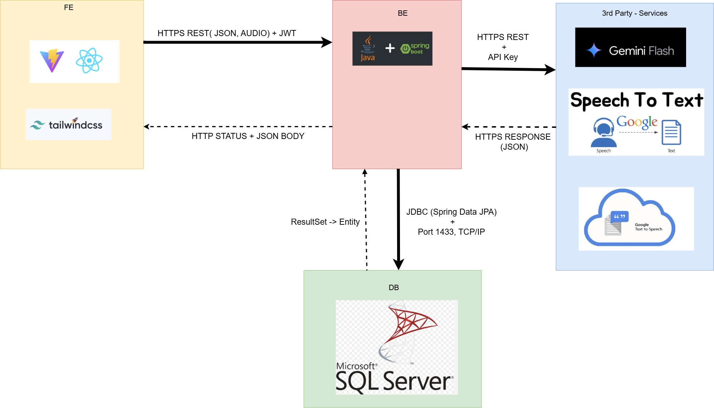
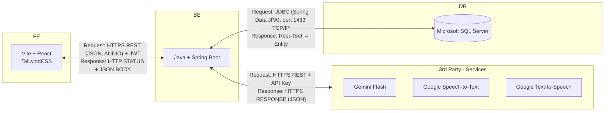
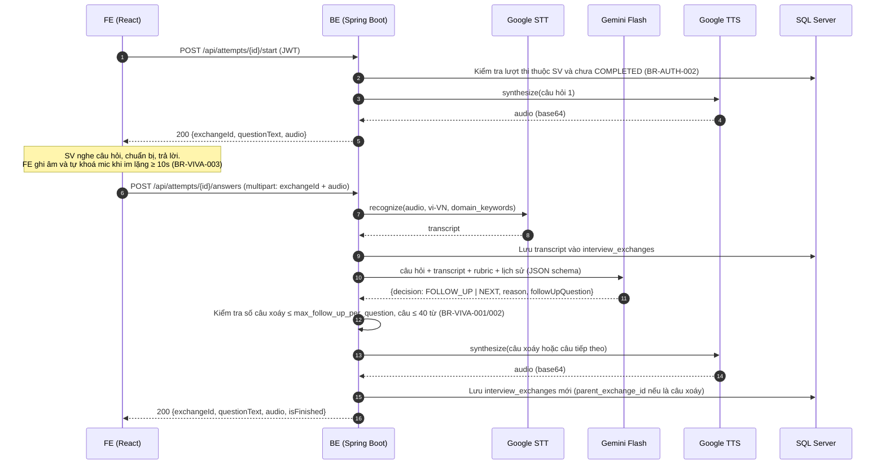

# Architecture Design - AIVES

> **Hệ thống**: AI-powered Viva Exam System (AIVES)  
> **Kiểu kiến trúc**: Client - Server, backend **Monolith** (1 ứng dụng Spring Boot) gọi dịch vụ AI bên thứ ba qua HTTPS REST.  
> **Liên quan**: [00-overview](../00-overview/README.md) · [01-business-rule](../01-business-rule/README.md) · [ERD](../ERD/README.md) · [03-context-diagram](../03-context-diagram/README.md) · [core-workflows](../core-workflows.md)

---

## 1. Sơ đồ kiến trúc



Bản Mermaid tương đương (sửa được trực tiếp trên GitHub):



Mỗi mũi tên hai chiều ghi cả request (chiều đi) và response (chiều về), giống các cặp nét liền / nét đứt trên ảnh.

---

## 2. Thành phần

| Khối | Công nghệ | Vai trò |
| :--- | :--- | :--- |
| **FE** | **Vite + React**, **TailwindCSS** | Web app cho cả sinh viên và giảng viên: phòng thi (ghi âm, phát câu hỏi, hiển thị transcript), quản lý bài học / câu hỏi / rubric / đề thi, màn hình thẩm định điểm, phúc khảo. |
| **BE** | **Java + Spring Boot** | Toàn bộ nghiệp vụ: xác thực JWT, phân quyền, điều phối phòng thi, gọi AI, chấm điểm, lưu dữ liệu. Là thành phần **duy nhất** giữ API key và được gọi dịch vụ AI. |
| **DB** | **Microsoft SQL Server** | Lưu toàn bộ dữ liệu nghiệp vụ theo [Physical ERD](../ERD/03-physical-erd.md) (16 bảng). |
| **3rd Party** | **Gemini Flash** | LLM: sinh câu hỏi gợi ý, quyết định hỏi xoáy (`BR-VIVA-001/002`), chấm điểm theo rubric (`BR-GRADE-001`). |
| | **Google Speech-to-Text** | Chuyển audio câu trả lời của sinh viên thành transcript (`BR-VIVA-004`). |
| | **Google Text-to-Speech** | Chuyển câu hỏi (text) thành giọng đọc để phát cho sinh viên. |

---

## 3. Giao tiếp giữa các khối

| # | Chiều | Giao thức | Dữ liệu | Ghi chú |
| :---: | :--- | :--- | :--- | :--- |
| 1 | FE → BE | HTTPS REST + JWT | JSON; audio câu trả lời gửi dạng `multipart/form-data` | JWT gửi trong header `Authorization: Bearer <token>` |
| 2 | BE → FE | HTTP response | Mã trạng thái HTTP + JSON body | Audio câu hỏi (TTS) trả về dạng base64 trong JSON hoặc qua một endpoint tải file riêng |
| 3 | BE → 3rd Party | HTTPS REST + API Key | JSON (prompt cho Gemini, audio base64 cho STT, text cho TTS) | API key chỉ nằm ở BE (biến môi trường), **không bao giờ** gửi xuống FE |
| 4 | 3rd Party → BE | HTTPS response | JSON (kết quả LLM, transcript, audio base64) | Output của Gemini yêu cầu trả đúng JSON schema để BE kiểm tra |
| 5 | BE → DB | JDBC qua Spring Data JPA | Câu lệnh SQL | Kết nối TCP/IP cổng **1433** |
| 6 | DB → BE | JDBC | `ResultSet` được Hibernate map thành Entity | |

**Mã trạng thái HTTP dùng thống nhất**: `200` / `201` thành công, `400` dữ liệu sai, `401` chưa đăng nhập / token hết hạn, `403` không đủ quyền (`BR-AUTH-002`), `404` không tìm thấy, `409` xung đột trạng thái (ví dụ bắt đầu lượt thi đã `COMPLETED`), `500` lỗi hệ thống, `502` / `504` lỗi hoặc quá thời gian khi gọi dịch vụ AI.

---

## 4. Tech stack

| Tầng | Công nghệ | Lý do chọn |
| :--- | :--- | :--- |
| FE | Vite + React (TypeScript khuyến nghị) | Build nhanh, cấu hình ít, hệ sinh thái lớn. |
| FE | TailwindCSS | Dựng giao diện nhanh, đồng bộ style giữa các màn hình. |
| FE | MediaRecorder / Web Audio API (có sẵn trong trình duyệt) | Ghi âm câu trả lời và đo khoảng lặng (`BR-VIVA-003`). Micro chỉ chạy trên `https://` hoặc `localhost`. |
| BE | Java + Spring Boot (Spring Web, Spring Security + JWT, Spring Data JPA, Bean Validation) | Chuẩn phổ biến cho backend Java, chia layer rõ ràng, tích hợp sẵn bảo mật và ORM. |
| DB | Microsoft SQL Server | CSDL quan hệ; dùng `NVARCHAR` để lưu tiếng Việt. |
| AI | Gemini Flash | Chi phí thấp, độ trễ thấp, hỗ trợ trả output theo JSON schema. |
| AI | Google Cloud Speech-to-Text / Text-to-Speech | Hỗ trợ tiếng Việt (`vi-VN`), gọi được qua REST. |

---

## 5. Bên trong BE

### 5.1. Phân tầng

```
Controller (REST API, nhận / trả DTO)
    │
    ▼
Service (nghiệp vụ, kiểm tra Business Rules, transaction)
    │                      │
    ▼                      ▼
Repository (JPA)      Integration client (Gemini, STT, TTS)
    │                      │
    ▼                      ▼
SQL Server            3rd Party Services
```

- Controller **không** chứa nghiệp vụ, chỉ nhận request, validate DTO và gọi Service.
- Service là nơi kiểm tra Business Rule (ví dụ lệch điểm > 2.0 phải có ghi chú).
- Gọi dịch vụ AI đi qua **interface** (`LlmClient`, `SpeechToTextClient`, `TextToSpeechClient`) để dễ mock khi test và đổi nhà cung cấp.

### 5.2. Module nghiệp vụ

| Module | Bảng sở hữu (Physical ERD) | Chức năng |
| :--- | :--- | :--- |
| `auth` | `users` | Đăng nhập, cấp JWT, quản lý tài khoản, phân quyền `ADMIN` / `LECTURER` / `STUDENT`. |
| `content` | `lessons`, `topics`, `questions`, `rubrics`, `rubric_criteria` | Quản lý bài học, ngân hàng câu hỏi, rubric; gọi Gemini sinh câu hỏi nháp (`BR-BANK-002`). |
| `exam` | `viva_exams`, `viva_exam_questions`, `viva_attempts` | Tạo phiên thi (sinh mã phiên + mã truy cập), chọn câu hỏi; sinh viên tự vào bằng 2 mã đó (tạo lượt thi `IN_PROGRESS`), đếm ngược thời gian, kết thúc bài thi. |
| `vivaroom` | `interview_exchanges` | Điều phối phòng thi: nhận audio, gọi STT → Gemini → TTS, quyết định hỏi xoáy. |
| `grading` | `question_grades`, `criteria_grades`, `grade_appeals` | Chấm điểm AI, giảng viên thẩm định / chốt điểm (HITL), công bố, phúc khảo. |
| `audit` / `jobs` | `audit_logs`, `system_settings`, `background_jobs` | Ghi vết, cấu hình hệ thống, chạy việc nền. |

### 5.3. Cấu trúc package gợi ý

```
src/main/java/com/aives/
├── AivesApplication.java
├── common/          # config, security (JWT filter), exception handler, dto dùng chung
├── modules/
│   ├── auth/        # controller/ service/ repository/ entity/ dto/
│   ├── content/
│   ├── exam/
│   ├── vivaroom/
│   ├── grading/
│   └── audit/
├── jobs/            # đọc bảng background_jobs và chạy việc nền (@Scheduled + @Async)
└── integration/
    ├── ai/          # LlmClient, GeminiClient, prompt template
    └── speech/      # SpeechToTextClient, TextToSpeechClient (Google)
```

### 5.4. Việc chạy nền

Chấm điểm AI cho cả bài thi mất nhiều thời gian, nên không chạy trong request của sinh viên:

1. Khi sinh viên nộp bài, BE cập nhật `viva_attempts.status = COMPLETED` và thêm 1 dòng `background_jobs` (`EVALUATE_ATTEMPT`) **trong cùng 1 transaction**.
2. Một tác vụ `@Scheduled` trong BE định kỳ lấy job `PENDING`, chạy bằng `@Async`.
3. Job lỗi được thử lại (`attempts < 3`); hết lượt thì `FAILED` và `result_status = GRADING_FAILED` để giảng viên chấm lại.

Cách này không cần thêm message broker (Redis, RabbitMQ...), đúng với sơ đồ chỉ có 4 khối.

---

## 6. Luồng xử lý chính

### 6.1. Một lượt hỏi - đáp trong phòng thi



### 6.2. Chấm điểm và công bố

1. Job `EVALUATE_ATTEMPT` đọc transcript + rubric của từng câu, gọi Gemini chấm từng tiêu chí kèm trích dẫn bằng chứng.
2. BE lưu `question_grades` (`AI_DRAFT`) và `criteria_grades`, chuyển `result_status = PENDING_REVIEW`.
3. Giảng viên xem transcript, duyệt hoặc sửa điểm (`graded_by`, ghi chú nếu lệch > 2.0) rồi bấm công bố → `PUBLISHED`.
4. Sinh viên chỉ xem được kết quả khi `PUBLISHED` (`BR-GRADE-003`), sau đó có thể gửi phúc khảo (`grade_appeals`).

---

## 7. Bảo mật

- Toàn bộ giao tiếp FE ↔ BE và BE ↔ 3rd Party qua **HTTPS**.
- **JWT** cấp khi đăng nhập; mọi API (trừ đăng nhập) phải có token. BE kiểm tra quyền theo role và theo quyền sở hữu dữ liệu (`BR-AUTH-001`, `BR-AUTH-002`).
- **API key** của Gemini và Google Cloud chỉ lưu ở BE (biến môi trường / file cấu hình không commit lên git).
- Mật khẩu lưu dạng băm (BCrypt) trong `users.password_hash`.
- SQL Server chỉ mở cổng 1433 cho BE, không mở ra Internet.

---

## 8. Vấn đề cần nhóm thống nhất

| # | Vấn đề | Chi tiết | Đề xuất |
| :---: | :--- | :--- | :--- |
| 1 | **Nơi lưu file audio** | Physical ERD có các cột `full_audio_key`, `question_audio_key`, `answer_audio_key` nhưng sơ đồ kiến trúc chưa có khối lưu file. | Lưu trong thư mục trên server BE (đơn giản nhất cho đồ án), hoặc thêm khối Object Storage vào sơ đồ. |
| 2 | **Độ dài audio gửi STT** | API nhận dạng đồng bộ của Google STT chỉ nhận audio ngắn (khoảng 1 phút), trong khi `answer_seconds` mặc định là 120 giây. | Giới hạn thời gian trả lời ≤ 60 giây, hoặc dùng chế độ nhận dạng dài (long-running). Nên kiểm tra lại giới hạn trên tài liệu Google Cloud trước khi chốt. |
| 3 | **REST thay cho WebSocket** | Sơ đồ chỉ dùng REST, trong khi `BR-AUTH-003` đang viết theo WebSocket (1 kết nối active / SV). | Sửa `BR-AUTH-003` theo REST, ví dụ: mỗi lượt thi chỉ có 1 phiên hợp lệ, request từ phiên cũ bị từ chối. |
| 4 | **Độ trễ ≤ 3 giây** (`BR-VIVA-003`) | Mỗi lượt gọi tuần tự STT → Gemini → TTS nên dễ vượt 3 giây. | Đo thực tế; nếu vượt thì trả text câu hỏi trước, audio TTS tải sau. |
| 5 | **Tài liệu cũ chưa khớp** | `00-overview` còn nhắc RAG, `BR-AUTH-001` còn nhắc `EXAM_EXAMINER`, `core-workflows` còn nhắc PostgreSQL / pgvector. | Cập nhật các tài liệu này theo ERD và kiến trúc mới. |
