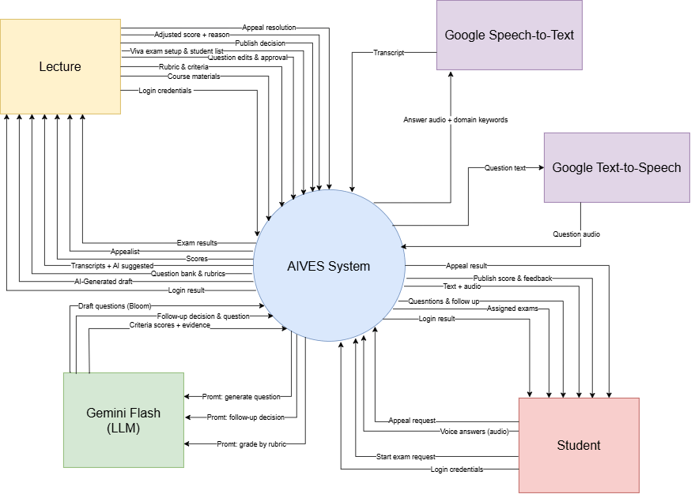

# Context Diagram - AIVES

> **Loại sơ đồ**: Context Diagram (DFD mức 0)  
> **Mục đích**: Xem toàn bộ hệ thống AIVES như **một process duy nhất** và mô tả các luồng dữ liệu giữa hệ thống với các thực thể bên ngoài.  
> **Liên quan**: [00-overview](../00-overview/README.md) · [02-architecture-design](../02-architecture-design/README.md) · [ERD](../ERD/README.md)

---

## 1. Sơ đồ

---

## 2. Thành phần

| Ký hiệu | Thành phần | Loại | Mô tả |
| :--- | :--- | :--- | :--- |
| Hình tròn | **AIVES System** | Process | Toàn bộ hệ thống (FE + BE + DB), xem như hộp đen. |
| Hình chữ nhật | **Lecturer** | Người dùng | Giảng viên: chuẩn bị câu hỏi / rubric, tạo đề thi, thẩm định và công bố điểm, xử lý phúc khảo. |
| Hình chữ nhật | **Student** | Người dùng | Sinh viên: làm bài thi vấn đáp bằng giọng nói, xem điểm, gửi phúc khảo. |
| Hình chữ nhật | **Gemini Flash (LLM)** | Hệ thống ngoài | Sinh câu hỏi, quyết định hỏi xoáy, chấm điểm theo rubric. |
| Hình chữ nhật | **Google Speech-to-Text** | Hệ thống ngoài | Chuyển audio câu trả lời thành transcript. |
| Hình chữ nhật | **Google Text-to-Speech** | Hệ thống ngoài | Chuyển câu hỏi dạng text thành audio. |

Các thực thể ngoài khớp với actor trong use case diagram (Lecturer, Student, AI Service). Riêng AI Service được tách thành 3 dịch vụ theo [sơ đồ kiến trúc](../02-architecture-design/README.md), vì mỗi dịch vụ nhận và trả dữ liệu khác nhau.

---

## 3. Luồng dữ liệu

### 3.1. Lecturer ↔ AIVES

| # | Chiều | Luồng dữ liệu | Use case liên quan |
| :---: | :--- | :--- | :--- |
| L1 | Lecturer → AIVES | Login credentials | Log in / Log out |
| L2 | Lecturer → AIVES | Course materials | Upload course materials |
| L3 | Lecturer → AIVES | Rubric & criteria | Assign rubric |
| L4 | Lecturer → AIVES | Question edits & approval | Review & edit questions, Approve question bank |
| L5 | Lecturer → AIVES | Viva exam setup | Tạo phiên thi; nhận mã phiên + mã truy cập để gửi cho sinh viên (không còn gán danh sách sinh viên; trên hình vẫn ghi "student list") |
| L6 | Lecturer → AIVES | Publish decision | Confirm & publish final score |
| L7 | Lecturer → AIVES | Adjusted score + reason | Adjust score with reason (`BR-GRADE-002`) |
| L8 | Lecturer → AIVES | Appeal resolution | View appeal |
| L9 | AIVES → Lecturer | Login result | Log in / Log out |
| L10 | AIVES → Lecturer | AI-generated draft questions | Generate questions (Bloom) |
| L11 | AIVES → Lecturer | Question bank & rubrics | Review & edit questions |
| L12 | AIVES → Lecturer | Transcripts + AI-suggested scores | Review AI-suggested score |
| L13 | AIVES → Lecturer | Scores | Review AI-suggested score |
| L14 | AIVES → Lecturer | Appeal list | View appeal |
| L15 | AIVES → Lecturer | Exam results | Confirm & publish final score |

### 3.2. Student ↔ AIVES

| # | Chiều | Luồng dữ liệu | Use case liên quan |
| :---: | :--- | :--- | :--- |
| S1 | Student → AIVES | Login credentials | Log in / Log out |
| S2 | Student → AIVES | Start exam request (mã phiên + mã truy cập) | Take viva exam |
| S3 | Student → AIVES | Voice answers (audio) | Answer by voice, Answer follow-up question |
| S4 | Student → AIVES | Appeal request | Appeal |
| S5 | AIVES → Student | Login result | Log in / Log out |
| S6 | AIVES → Student | Assigned exams | Take viva exam |
| S7 | AIVES → Student | Questions & follow-up questions | Take viva exam, Answer follow-up question |
| S8 | AIVES → Student | Text + audio (của câu hỏi) | Take viva exam |
| S9 | AIVES → Student | Published score & feedback | View score (`BR-GRADE-003`) |
| S10 | AIVES → Student | Appeal result | Appeal |

### 3.3. AIVES ↔ Dịch vụ AI

| # | Chiều | Luồng dữ liệu | Mục đích |
| :---: | :--- | :--- | :--- |
| A1 | AIVES → Gemini | Prompt: generate question | Sinh câu hỏi nháp theo Bloom từ tài liệu môn học (`BR-BANK-002`) |
| A2 | AIVES → Gemini | Prompt: follow-up decision | Gửi câu hỏi + transcript + rubric để AI quyết định hỏi xoáy (`BR-VIVA-001`) |
| A3 | AIVES → Gemini | Prompt: grade by rubric | Gửi transcript + rubric để chấm điểm (`BR-GRADE-001`) |
| A4 | Gemini → AIVES | Draft questions (Bloom) | Câu hỏi nháp, lưu với trạng thái `DRAFT` |
| A5 | Gemini → AIVES | Follow-up decision & question | `FOLLOW_UP` / `NEXT` kèm câu hỏi xoáy ≤ 40 từ (`BR-VIVA-002`) |
| A6 | Gemini → AIVES | Criteria scores + evidence | Điểm từng tiêu chí kèm trích dẫn từ transcript |
| A7 | AIVES → Google STT | Answer audio + domain keywords | Audio câu trả lời kèm thuật ngữ chuyên ngành (`BR-VIVA-004`) |
| A8 | Google STT → AIVES | Transcript | Văn bản câu trả lời |
| A9 | AIVES → Google TTS | Question text | Nội dung câu hỏi / câu xoáy |
| A10 | Google TTS → AIVES | Question audio | Audio để phát cho sinh viên |

**Tổng cộng**: 35 luồng dữ liệu (Lecturer 15, Student 10, Gemini 6, STT 2, TTS 2).

---

## 4. Ghi chú

- Context Diagram **không** vẽ kho dữ liệu (SQL Server) vì đó là thành phần bên trong hệ thống. Kho dữ liệu sẽ xuất hiện ở DFD mức 1.
- Luồng **Course materials** (L2) và **Prompt: generate question** (A1) đến từ use case *Upload course materials*. Hiện [ERD](../ERD/README.md) chưa có thực thể lưu tài liệu môn học, nên nhóm cần bổ sung ERD hoặc bỏ 2 luồng này cho khớp.
- Không có actor **Admin** vì use case diagram không có Admin.

---

## 5. Điểm cần sửa trên hình

Tài liệu ở mục 3 đã ghi đúng chính tả; các lỗi dưới đây nằm trên file draw.io, cần sửa rồi xuất lại ảnh:

| Trên hình | Sửa thành |
| :--- | :--- |
| `Lecture` | `Lecturer` |
| `Appealist` | `Appeal list` |
| `Promt: generate question` / `Promt: follow-up decision` / `Promt: grade by rubric` | `Prompt: ...` (3 chỗ) |
| `Quesntions & follow up` | `Questions & follow-up questions` |
| `Publish score & feedback` | `Published score & feedback` |
| `Transcripts + AI suggested` | `Transcripts + AI-suggested scores` (hoặc gộp với luồng `Scores`) |
| `AI-Generated draft` | `AI-generated draft questions` |

Khi xuất lại, nên export PNG từ draw.io với **Zoom 200%** (ảnh hiện tại chỉ 874×626 nên chữ nhỏ) và commit kèm file `.drawio` gốc vào thư mục này để người khác sửa được.
