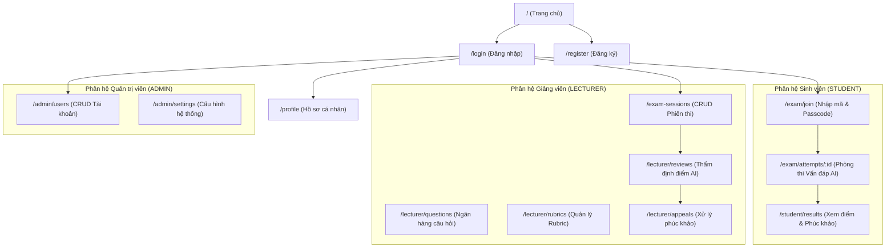

# UI/UX Design - AIVES (AI-powered Viva Exam System)

> **Hệ thống**: AI-powered Viva Exam System (AIVES)  
> **Mục đích**: Tài liệu thiết kế giao diện và trải nghiệm người dùng (UI/UX Design), hệ thống Design System, luồng người dùng (User Flows), kiến trúc thông tin và đặc tả các màn hình ứng dụng.  
> **Mã nguồn Frontend**: Repository `aives-frontend` (React 19 + Vite + TailwindCSS v4).

---

## 1. Mục tiêu thiết kế & Chân dung người dùng (User Personas)

### 1.1. Mục tiêu
- **Giảm áp lực thi cử (Exam Anxiety Reduction)**: Giao diện phòng thi trực quan, hiển thị đồng hồ đếm ngược, trạng thái mic/âm thanh rõ ràng, thông báo chuyển câu mượt mà.
- **Tập trung cao độ (Distraction-Free Viva Room)**: Không gian phòng thi tối giản, làm nổi bật câu hỏi, hiển thị dạng sóng âm thanh (Voice Wave) khi sinh viên trả lời.
- **Tiện ích quản lý cho Giảng viên & Admin**: Bảng điều khiển quản lý phiên thi (Exam Sessions), ngân hàng câu hỏi, ma trận tiêu chí chấm (Rubric) và màn hình thẩm định điểm AI với tính năng xem lại transcript & audio trực tiếp.

### 1.2. Chân dung người dùng

| Vai trò | Nhu cầu chính | Màn hình trọng tâm |
| :--- | :--- | :--- |
| **Sinh viên (STUDENT)** | Nhập mã vào phòng thi nhanh, kiểm tra mic trước khi vào, làm bài thi vấn đáp tự động với AI, xem kết quả điểm và gửi phúc khảo. | `/exam/join`<br/>`/exam/attempts/:id`<br/>`/student/results` |
| **Giảng viên (LECTURER)** | Tạo và cấu hình phiên thi (thời gian, câu xoáy, từ khoá), quản lý bộ câu hỏi & rubric, thẩm định và duyệt điểm do AI chấm. | `/exam-sessions`<br/>`/lecturer/questions`<br/>`/lecturer/rubrics`<br/>`/lecturer/reviews` |
| **Quản trị viên (ADMIN)** | Quản lý toàn bộ tài khoản người dùng (tạo mới, khoá/kích hoạt, xoá), cấu hình hệ thống (model AI, tham số STT/TTS). | `/admin/users`<br/>`/admin/settings` |

---

## 2. Kiến trúc thông tin (Site Map)



---

## 3. Design System & Quy chuẩn thị giác

Hệ thống tuân thủ nguyên lý thiết kế **Material Design 3 (M3)** với bảng màu hiện đại, tương phản chuẩn WCAG 2.1 AA:

### 3.1. Bảng màu (Color Tokens)
- **Primary (`#006495` / `#90CDF4`)**: Màu xanh chủ đạo, biểu trưng cho sự tin cậy, giáo dục và công nghệ. Dùng cho nút chính (Call to Action), trạng thái tiến trình, điểm nhấn.
- **Secondary (`#50606E`)**: Màu trung tính hỗ trợ cho thanh điều hướng, nhãn phụ, thẻ lọc.
- **Surface & Background (`#F8FAFC` / `#0F172A`)**: Màu nền sáng và tối dịu mắt, tránh chói lóa khi thí sinh làm bài thi lâu.
- **Status Colors**:
  - `Success` (`#16A34A`): Trạng thái ONGOING, hoàn thành chấm, đã duyệt.
  - `Warning / Attention` (`#D97706`): Đang chấm dở, câu hỏi cần bổ sung rubric, sắp hết giờ.
  - `Error` (`#DC2626`): Đã huỷ, mic ngắt kết nối, lỗi kết nối, quá giờ.

### 3.2. Typography
- **Font gia đình**: `Plus Jakarta Sans`, `Inter`, `Roboto` cho khả năng đọc tốt trên màn hình độ phân giải cao.
- **Thang kích thước**:
  - `Display Large`: 32px / 40px (Tiêu đề chính phòng thi, Banner trang chủ)
  - `Headline Medium`: 24px / 32px (Tiêu đề trang quản lý)
  - `Title Medium`: 16px / 24px (Tên câu hỏi, tiêu đề thẻ bài thi)
  - `Body Regular`: 14px / 20px (Nội dung câu hỏi, transcript, ghi chú)
  - `Label Small`: 12px / 16px (Trọng số rubric, huy hiệu trạng thái - Badge)

---

## 4. Đặc tả trải nghiệm các màn hình trọng tâm

### 4.1. Màn hình Phòng thi Vấn đáp AI (`/exam/attempts/:id` - ExamRoomPage)
Đây là màn hình cốt lõi nhất của hệ thống, đòi hỏi sự tập trung và độ trễ thấp:

```
+-------------------------------------------------------------------------+
| [AIVES Logo]  Mã phiên: AIVES_EXAM_2026_049282   | Thời gian còn: 14:32 |
+-------------------------------------------------------------------------+
|                                                                         |
|   +-------------------------- TIẾN TRÌNH ---------------------------+   |
|   | Câu hỏi 2 / 5   [===== 40% =====                                ]   |
|   | (Câu xoáy 1/2)                                                  |
|   +-----------------------------------------------------------------+   |
|                                                                         |
|   +----------------------- HỘP THOẠI AI ----------------------------+   |
|   | [AI Avatar Đang phát âm thanh]                                  |
|   | "Hãy giải thích cơ chế Garbage Collection trong Java và         |
|   |  sự khác nhau giữa Minor GC và Major GC?"                       |
|   +-----------------------------------------------------------------+   |
|                                                                         |
|   +--------------------- TRẠNG THÁI TRẢ LỜI ------------------------+   |
|   |                                                                 |
|   |     Trạng thái: ĐANG LẮNG NGHE SINH VIÊN (MIC ON)               |
|   |     [|||||||||||||||| Sóng âm thanh dao động |||||||||||||||]   |
|   |     Khoảng lặng đo được: 2.1s (Tự ngắt nếu lặng >= 10s)         |
|   |                                                                 |
|   |     Transcript tạm thời:                                        |
|   |     "Trong Java, Garbage Collection dùng để tự động thu hồi... " |
|   |                                                                 |
|   |     [ Nút: KẾT THÚC CÂU TRẢ LỜI SỚM ]                           |
|   +-----------------------------------------------------------------+   |
|                                                                         |
+-------------------------------------------------------------------------+
```

- **Microphone & VAD Interaction**:
  - Tích hợp `Web Audio API` hiển thị biểu đồ tần số âm thanh động (Audio Visualizer).
  - Tự động phát hiện im lặng ≥ 10s (`BR-VIVA-003`) để chốt câu trả lời và chuyển sang phân tích LLM.
- **Anti-Cheat & UX Controls**:
  - Khóa toàn màn hình (Full Screen mode), cảnh báo khi chuyển tab.
  - Bộ đếm thời gian kép: Thời gian toàn bài và thời gian trả lời câu hiện tại (`answer_seconds`).

---

### 4.2. Màn hình Quản lý Phiên thi CRUD (`/exam-sessions` - ExamSessionsPage)
Giao diện quản lý trực quan dạng thẻ bài (Card grid) kết hợp bảng dữ liệu:

- **Bộ lọc đa chiều**: Tab trạng thái (`Tất cả`, `Đang diễn ra`, `Sắp diễn ra`, `Đã kết thúc`, `Đã huỷ`), thanh tìm kiếm theo tên/mã phiên, phân trang mượt mà.
- **Thao tác nhanh**:
  - Nút **Tạo phiên mới** (Modal popup đầy đủ kiểm soát ngày giờ, thời lượng, câu xoáy, từ khóa).
  - Nút **Chép mã vào thi (Copy Button)** và **Chép mã truy cập (Passcode)** 1 chạm kèm hiệu ứng sao chép thành công.
  - Nút **Đổi Passcode mới** bảo mật tức thì.
  - Nút **Chỉnh sửa** và **Huỷ / Xoá phiên**.

---

### 4.3. Màn hình Quản trị Tài khoản CRUD (`/admin/users` - AdminUsersPage)
Giao diện dành riêng cho Administrator quản trị thành viên:

- **Tab vai trò**: `Tất cả`, `Sinh viên`, `Giảng viên`, `Quản trị viên`.
- **Hành động nghiệp vụ**:
  - Thêm tài khoản mới (Hỗ trợ sinh mã định dạng `STxxxxxx`, `LExxxxxx`, `ADxxxxxx`).
  - Nút chuyển trạng thái nhanh (Kích hoạt / Vô hiệu hóa) với màu sắc trực quan (Xanh / Xám).
  - Xóa tài khoản có hộp thoại xác nhận an toàn (Confirm Dialog).

---

### 4.4. Màn hình Thẩm định & Duyệt điểm (`/lecturer/reviews/:id` - LecturerReviewPage)
Giúp giảng viên kiểm tra công tâm kết quả chấm điểm của AI:

- **Hai cột đối sánh (Split View)**:
  - Cột trái: Lịch sử hội thoại từng câu (Câu gốc, các câu xoáy con), Audio ghi âm có thanh tua (Audio Player), bản dịch Transcript có tô sáng từ khóa.
  - Cột phải: Bảng điểm Rubric do AI đề xuất, điểm từng tiêu chí, trích dẫn bằng chứng (`evidence_quote`) và điểm tổng kết.
- **Quyền ghi đè điểm (Score Override)**: Giảng viên có thể điều chỉnh điểm và nhập lý do nếu chênh lệch > 2.0 điểm (`BR-GRADE-002`) trước khi bấm nút **Công bố điểm** (`PUBLISHED`).

---

## 5. Tương thích Đa nền tảng & Responsive

Hệ thống thiết kế theo nguyên lý **Mobile-First & Adaptive**:
- **Desktop (>= 1024px)**: Giao diện đầy đủ hai cột, tối ưu cho giảng viên soạn thảo đề thi và sinh viên ngồi máy tính làm bài viva với webcam/micro.
- **Tablet (768px - 1023px)**: Bảng dữ liệu tự động chuyển sang chế độ cuộn ngang mượt mà, menu thu gọn dạng Sidebar/Drawer.
- **Mobile (< 768px)**: Thẻ bài thu gọn, nút bấm to bản hỗ trợ cảm ứng (tối thiểu 48x48px), thanh điều hướng đáy (Bottom Navigation Bar) thuận tiện thao tác một tay.
