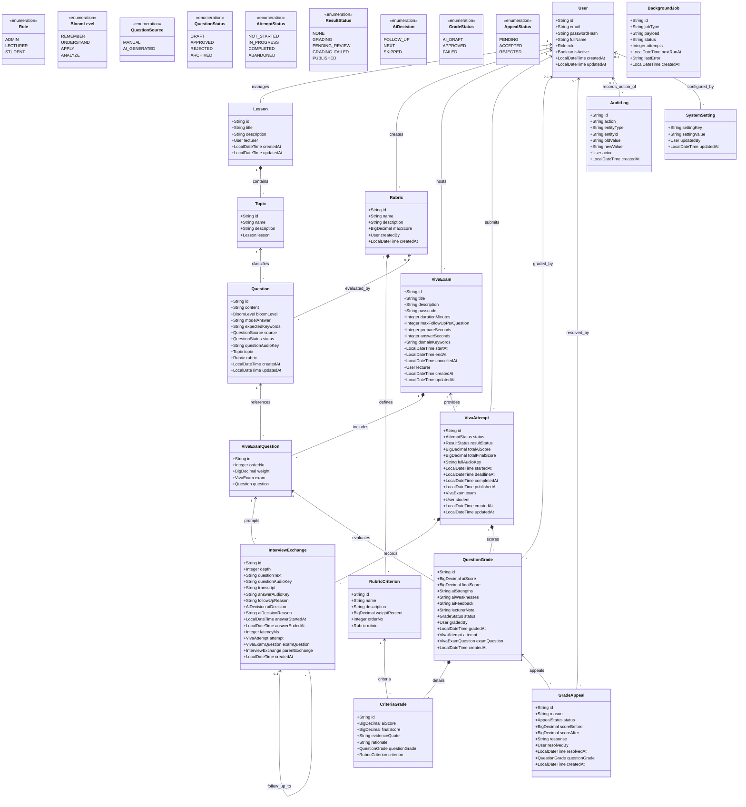
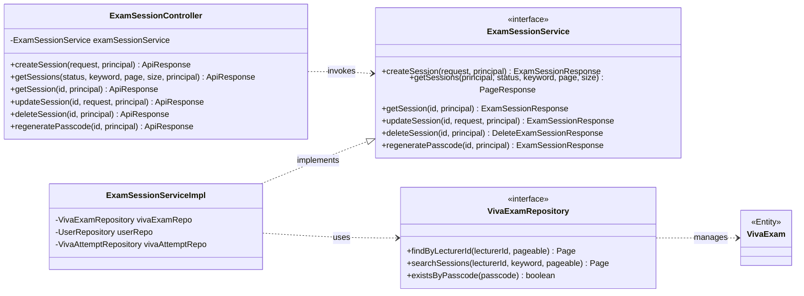

# Class Diagram - AIVES (AI-powered Viva Exam System)

> **Hệ thống**: AI-powered Viva Exam System (AIVES)  
> **Mục đích**: Mô tả cấu trúc lớp đối tượng của hệ thống, bao gồm **Domain Entity Model** (16 thực thể JPA ánh xạ CSDL) và **Layered Architecture Model** (Controller → Service → Repository → DTO).  
> **Mã nguồn Mermaid**: [class-diagram.mmd](class-diagram.mmd)  
> **Triển khai**: Đã triển khai đầy đủ trong `aives-backend` sử dụng Java 17, Spring Boot 3 và Hibernate JPA.

---

## 1. Sơ đồ Lớp miền Nghiệp vụ (Domain Entities Class Diagram)

Sơ đồ thể hiện toàn bộ các thực thể JPA, các thuộc tính chính, kiểu dữ liệu, các Enum và mối quan hệ giữa các thực thể:

---

## 2. Đặc tả các gói và lớp Entity theo Mô-đun Backend

### 2.1. Gói `com.aives.modules.auth`
- **`User`**: Đại diện cho người dùng hệ thống (Admin, Giảng viên, Sinh viên).
- **`Role`**: Enum phân quyền: `ADMIN`, `LECTURER`, `STUDENT`.

### 2.2. Gói `com.aives.modules.content`
- **`Lesson`**: Bài học do Giảng viên quản lý.
- **`Topic`**: Chủ đề kiến thức trực thuộc bài học.
- **`Rubric`**: Ma trận thang điểm dùng để hướng dẫn AI và Giảng viên đánh giá.
- **`RubricCriterion`**: Tiêu chí chấm chi tiết, có trọng số phần trăm (`weightPercent`, tổng = 100%).
- **`Question`**: Câu hỏi trong ngân hàng câu hỏi; phân loại theo `bloomLevel` (Nhận biết, Thông hiểu, Vận dụng, Phân tích) và trạng thái duyệt `status`.

### 2.3. Gói `com.aives.modules.exam`
- **`VivaExam`**: Phiên thi vấn đáp trực tuyến do Giảng viên hoặc Admin mở. Khóa chính `viva_exams_id` (độ dài 30) đồng thời là mã phòng thi. Chứa tham số cấu hình: `durationMinutes`, `prepareSeconds`, `answerSeconds`, `maxFollowUpPerQuestion`, `domainKeywords`.
- **`VivaExamQuestion`**: Bảng quan hệ N-N gắn câu hỏi vào đề thi với thứ tự `orderNo` và hệ số điểm `weight`.
- **`VivaAttempt`**: Lượt thi của từng sinh viên trong phiên, lưu trữ hạn chốt nộp bài (`deadlineAt`), điểm AI chấm (`totalAiScore`), điểm duyệt cuối (`totalFinalScore`) và file audio toàn bài (`fullAudioKey`).

### 2.4. Gói `com.aives.modules.vivaroom`
- **`InterviewExchange`**: Mỗi lượt hỏi - đáp giữa AI và Thí sinh.
  - Hỗ trợ quan hệ tự tham chiếu (`parentExchange`): Khi thí sinh trả lời chưa rõ ràng, AI quyết định sinh câu hỏi xoáy (`depth > 0`), liên kết trực tiếp với câu hỏi gốc (`depth = 0`).
  - Ghi nhận độ trễ (`latencyMs`), thời gian trả lời (`answerStartedAt`, `answerEndedAt`), tệp âm thanh câu hỏi TTS và câu trả lời STT.

### 2.5. Gói `com.aives.modules.grading`
- **`QuestionGrade`**: Điểm số và nhận xét điểm mạnh/yếu của AI cho từng câu hỏi trong bài thi.
- **`CriteriaGrade`**: Điểm chi tiết cho từng tiêu chí của Rubric kèm đoạn trích bằng chứng thực tế (`evidenceQuote`) lấy từ câu trả lời của thí sinh.
- **`GradeAppeal`**: Đơn khiếu nại/phúc khảo điểm của sinh viên và quyết định phê duyệt của giảng viên.

### 2.6. Gói `com.aives.modules.system`
- **`BackgroundJob`**: Hàng đợi các tác vụ bất đồng bộ (chấm điểm AI, đồng bộ audio S3/GCS).
- **`AuditLog`**: Nhật ký lưu vết mọi thao tác nhạy cảm (sửa điểm, duyệt bài, đổi trạng thái).
- **`SystemSetting`**: Cấu hình toàn hệ thống dạng Key - Value.

---

## 3. Sơ đồ Kiến trúc Phân tầng (Layered Class Diagram)

Sơ đồ thể hiện cách các lớp trong Backend phối hợp theo mô hình chuẩn **Controller → Service → Repository → Database**:

