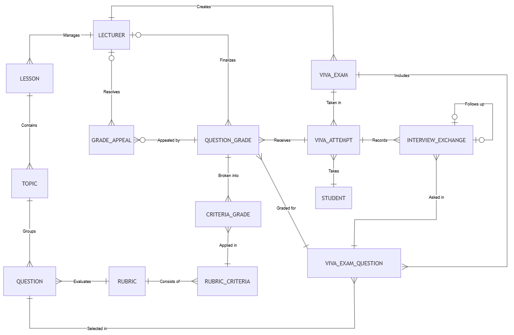

# Conceptual ERD - AIVES

> **Mức**: Conceptual (quan niệm) - chỉ gồm thực thể, quan hệ và bản số, chưa có thuộc tính.  
> **Mã nguồn**: [conceptual-erd.mmd](conceptual-erd.mmd)  
> **Căn cứ**: [00-overview](../00-overview/README.md), [01-business-rule](../01-business-rule/README.md)

---

## 1. Sơ đồ

---

## 2. Danh sách thực thể (14)

Các thực thể được chia theo 4 nhóm nghiệp vụ, tương ứng 4 module BE.

### 2.1. Người dùng

| Thực thể | Ý nghĩa |
| :--- | :--- |
| `LECTURER` | Giảng viên. Quản lý bài học, tạo đề thi, chốt điểm và xử lý phúc khảo. |
| `STUDENT` | Sinh viên. Làm bài thi vấn đáp với AI và xem kết quả đã công bố. |

### 2.2. Nội dung & Ngân hàng câu hỏi (module `content`)

| Thực thể | Ý nghĩa |
| :--- | :--- |
| `LESSON` | Bài học / môn học do giảng viên quản lý. Là gốc của cây nội dung. |
| `TOPIC` | Chủ đề kiến thức trong một bài học, dùng để phân nhóm câu hỏi. |
| `QUESTION` | Câu hỏi trong ngân hàng (giảng viên tạo hoặc AI sinh), có mức Bloom, đáp án mẫu, từ khoá mong đợi. |
| `RUBRIC` | Bộ tiêu chí chấm điểm, dùng lại được cho nhiều câu hỏi. |
| `RUBRIC_CRITERIA` | Một tiêu chí trong rubric, có trọng số (%). Tổng trọng số của 1 rubric = 100% (`BR-BANK-001`). |

### 2.3. Đề thi & Phòng thi (module `exam`, `vivaroom`)

| Thực thể | Ý nghĩa |
| :--- | :--- |
| `VIVA_EXAM` | Đề thi / đợt thi vấn đáp do giảng viên tạo, chứa cấu hình thời gian và số lần hỏi xoáy tối đa. |
| `VIVA_EXAM_QUESTION` | Câu hỏi được chọn vào một đề thi (kèm thứ tự và trọng số). Là thực thể trung gian giữa `VIVA_EXAM` và `QUESTION`. |
| `VIVA_ATTEMPT` | Một lượt thi của một sinh viên cho một đề thi. |
| `INTERVIEW_EXCHANGE` | Một lượt hỏi - đáp trong phòng thi: câu hỏi AI đọc, transcript câu trả lời, quyết định hỏi xoáy của AI (`BR-VIVA-001`, `BR-VIVA-002`). |

### 2.4. Chấm điểm & Phúc khảo (module `grading`)

| Thực thể | Ý nghĩa |
| :--- | :--- |
| `QUESTION_GRADE` | Điểm của một câu hỏi trong một lượt thi: điểm AI đề xuất và điểm giảng viên chốt (HITL, `BR-GRADE-002`). |
| `CRITERIA_GRADE` | Điểm chi tiết theo từng tiêu chí rubric, kèm trích dẫn bằng chứng từ transcript (`BR-GRADE-001`). |
| `GRADE_APPEAL` | Đơn phúc khảo của sinh viên cho điểm một câu hỏi. |

---

## 3. Quan hệ & bản số (20 quan hệ)

| # | Quan hệ | Ký hiệu | Diễn giải |
| :---: | :--- | :---: | :--- |
| 1 | `LECTURER` **Manages** `LESSON` | `\|\|--\|{` | Mỗi bài học do đúng 1 giảng viên quản lý (`BR-AUTH-001`). |
| 2 | `LESSON` **Contains** `TOPIC` | `\|\|--\|{` | Bài học gồm 1..n chủ đề. |
| 3 | `TOPIC` **Groups** `QUESTION` | `\|\|--\|{` | Mỗi câu hỏi thuộc đúng 1 chủ đề. |
| 4 | `RUBRIC` **Evaluates** `QUESTION` | `\|\|--\|{` | Mỗi câu hỏi được chấm theo 1 rubric; 1 rubric dùng cho nhiều câu (`BR-BANK-001`). |
| 5 | `RUBRIC` **Consists of** `RUBRIC_CRITERIA` | `\|\|--\|{` | Rubric gồm 1..n tiêu chí (`BR-BANK-003`). |
| 6 | `LECTURER` **Creates** `VIVA_EXAM` | `\|\|--\|{` | Mỗi đề thi do đúng 1 giảng viên tạo. |
| 7 | `VIVA_EXAM` **Includes** `VIVA_EXAM_QUESTION` | `\|\|--\|{` | Đề thi gồm 1..n câu hỏi. |
| 8 | `QUESTION` **Selected in** `VIVA_EXAM_QUESTION` | `\|\|--\|{` | Một câu hỏi có thể được chọn vào nhiều đề thi. |
| 9 | `VIVA_EXAM` **Taken in** `VIVA_ATTEMPT` | `\|\|--\|{` | Đề thi (phiên thi) có nhiều lượt thi; mỗi sinh viên vào phiên có đúng 1 lượt. |
| 10 | `STUDENT` **Takes** `VIVA_ATTEMPT` | `\|\|--\|{` | Mỗi lượt thi thuộc đúng 1 sinh viên (`BR-AUTH-002`). |
| 11 | `VIVA_ATTEMPT` **Records** `INTERVIEW_EXCHANGE` | `\|\|--\|{` | Lượt thi ghi lại toàn bộ các lượt hỏi - đáp. |
| 12 | `VIVA_EXAM_QUESTION` **Asked in** `INTERVIEW_EXCHANGE` | `\|\|--\|{` | Mỗi lượt hỏi - đáp thuộc về 1 câu hỏi của đề (câu gốc hoặc câu xoáy). |
| 13 | `INTERVIEW_EXCHANGE` **Follows up** `INTERVIEW_EXCHANGE` | `\|o--o\|` | Tự tham chiếu 0..1 - 0..1: câu hỏi xoáy nối tiếp một lượt trước đó, tạo thành chuỗi hỏi xoáy. Độ dài chuỗi bị giới hạn bởi `max_follow_up_per_question` (`BR-VIVA-001`). |
| 14 | `VIVA_ATTEMPT` **Receives** `QUESTION_GRADE` | `\|\|--\|{` | Lượt thi nhận điểm cho từng câu hỏi. |
| 15 | `VIVA_EXAM_QUESTION` **Graded for** `QUESTION_GRADE` | `\|\|--\|{` | Mỗi điểm câu hỏi gắn với đúng 1 câu hỏi của đề. |
| 16 | `LECTURER` **Finalizes** `QUESTION_GRADE` | `\|o--\|{` | Giảng viên chốt điểm (HITL). Phía LECTURER là 0..1 vì lúc AI vừa chấm xong thì chưa có ai chốt. |
| 17 | `QUESTION_GRADE` **Broken into** `CRITERIA_GRADE` | `\|\|--\|{` | Điểm câu hỏi được tách theo từng tiêu chí. |
| 18 | `RUBRIC_CRITERIA` **Applied in** `CRITERIA_GRADE` | `\|\|--\|{` | Mỗi điểm tiêu chí ứng với đúng 1 tiêu chí rubric. |
| 19 | `QUESTION_GRADE` **Appealed by** `GRADE_APPEAL` | `\|\|--o{` | Một điểm câu hỏi có 0..n đơn phúc khảo. |
| 20 | `LECTURER` **Resolves** `GRADE_APPEAL` | `\|o--\|{` | Giảng viên xử lý phúc khảo. Phía LECTURER là 0..1 vì đơn đang chờ thì chưa có người xử lý. |

---

## 4. Luồng dữ liệu đọc theo sơ đồ

1. **Chuẩn bị nội dung**: `LECTURER` → `LESSON` → `TOPIC` → `QUESTION` (gắn `RUBRIC` gồm các `RUBRIC_CRITERIA`).
2. **Tạo phiên thi & sinh viên vào thi**: `LECTURER` tạo `VIVA_EXAM`, chọn câu hỏi thành `VIVA_EXAM_QUESTION`, nhận mã phiên + mã truy cập và gửi cho sinh viên. `STUDENT` nhập 2 mã này để vào phiên → mỗi `STUDENT` có 1 `VIVA_ATTEMPT` trong phiên đó.
3. **Thi vấn đáp**: mỗi câu trong đề sinh ra các `INTERVIEW_EXCHANGE`; câu xoáy nối với lượt trước qua quan hệ **Follows up**.
4. **Chấm điểm**: AI tạo `QUESTION_GRADE` + các `CRITERIA_GRADE`; `LECTURER` chốt điểm (**Finalizes**).
5. **Phúc khảo**: `STUDENT` gửi `GRADE_APPEAL` cho điểm câu hỏi; `LECTURER` xử lý (**Resolves**).

---

## 5. Ghi chú thiết kế

- **Không có thực thể kết quả tổng** (`EXAM_RESULT`): tổng điểm và trạng thái công bố nằm trực tiếp trên `VIVA_ATTEMPT` (xem Logical/Physical).
- **Không có RAG**: ERD hiện tại không có thực thể tài liệu / chunk / embedding. Nếu cần AI đọc giáo trình thì phải bổ sung thực thể và cập nhật cả 3 mức ERD.
- **Không có Admin** trong ERD: tài khoản Admin được xử lý ở mức Physical (cột `role` trong bảng `users`).
