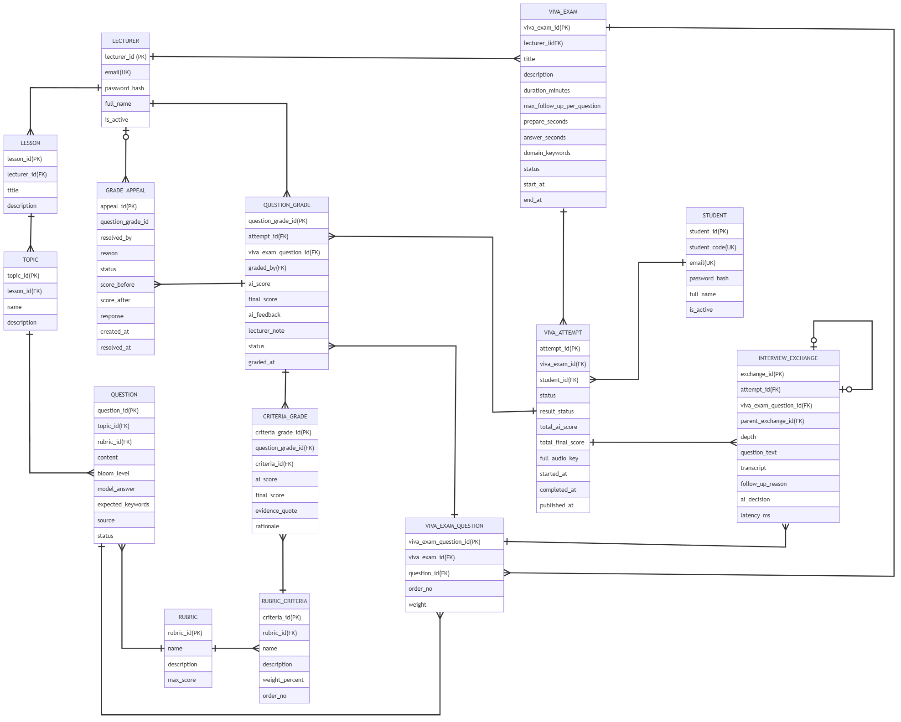

# Logical ERD - AIVES

> **Mức**: Logical - thêm thuộc tính, khoá chính (PK), khoá ngoại (FK), khoá duy nhất (UK). Chưa phụ thuộc DBMS.  
> **Mã nguồn**: [logical-erd.mmd](logical-erd.mmd) (file `.mmd` ghi thêm kiểu dữ liệu logic vì Mermaid bắt buộc có kiểu)  
> **Đi từ**: [01-conceptual-erd.md](01-conceptual-erd.md) · **Đi tiếp**: [03-physical-erd.md](03-physical-erd.md)

---

## 1. Sơ đồ

---

## 2. Quy ước

- **Khoá**: `PK` khoá chính, `FK` khoá ngoại, `UK` giá trị duy nhất.
- **Tên khoá chính**: `<tên thực thể>_id` (ví dụ `lesson_id`, `attempt_id`).
- **Kiểu dữ liệu logic** (cột "Kiểu" trong bảng dưới): `string` chuỗi ngắn, `text` chuỗi dài, `int` số nguyên, `decimal` số thực, `datetime` ngày giờ, `boolean` đúng/sai, `enum` chỉ nhận một tập giá trị cố định. Sang Physical mới đổi thành kiểu của SQL Server.
- Quan hệ và bản số giữ nguyên như Conceptual ERD (20 quan hệ).

---

## 3. Thuộc tính từng thực thể

### 3.1. `LECTURER`

| Thuộc tính | Khoá | Kiểu | Mô tả |
| :--- | :---: | :--- | :--- |
| `lecturer_id` | PK | int | Mã giảng viên |
| `email` | UK | string | Email đăng nhập |
| `password_hash` | | string | Mật khẩu đã băm |
| `full_name` | | string | Họ tên |
| `is_active` | | boolean | Tài khoản còn hoạt động |

### 3.2. `STUDENT`

| Thuộc tính | Khoá | Kiểu | Mô tả |
| :--- | :---: | :--- | :--- |
| `student_id` | PK | int | Mã định danh sinh viên trong hệ thống |
| `student_code` | UK | string | Mã số sinh viên (MSSV) |
| `email` | UK | string | Email đăng nhập |
| `password_hash` | | string | Mật khẩu đã băm |
| `full_name` | | string | Họ tên |
| `is_active` | | boolean | Tài khoản còn hoạt động |

### 3.3. `LESSON`

| Thuộc tính | Khoá | Kiểu | Mô tả |
| :--- | :---: | :--- | :--- |
| `lesson_id` | PK | int | Mã bài học |
| `lecturer_id` | FK → `LECTURER` | int | Giảng viên quản lý (**Manages**) |
| `title` | | string | Tên bài học |
| `description` | | text | Mô tả |

### 3.4. `TOPIC`

| Thuộc tính | Khoá | Kiểu | Mô tả |
| :--- | :---: | :--- | :--- |
| `topic_id` | PK | int | Mã chủ đề |
| `lesson_id` | FK → `LESSON` | int | Bài học chứa chủ đề (**Contains**) |
| `name` | | string | Tên chủ đề |
| `description` | | text | Mô tả |

### 3.5. `QUESTION`

| Thuộc tính | Khoá | Kiểu | Mô tả |
| :--- | :---: | :--- | :--- |
| `question_id` | PK | int | Mã câu hỏi |
| `topic_id` | FK → `TOPIC` | int | Chủ đề (**Groups**) |
| `rubric_id` | FK → `RUBRIC` | int | Rubric chấm câu này (**Evaluates**) |
| `content` | | text | Nội dung câu hỏi |
| `bloom_level` | | enum | `REMEMBER`, `UNDERSTAND`, `APPLY`, `ANALYZE` |
| `model_answer` | | text | Đáp án mẫu |
| `expected_keywords` | | text | Các ý / từ khoá cần có |
| `source` | | enum | `MANUAL`, `AI_GENERATED` (`BR-BANK-002`) |
| `status` | | enum | `DRAFT`, `APPROVED`, `REJECTED`, `ARCHIVED` |

### 3.6. `RUBRIC`

| Thuộc tính | Khoá | Kiểu | Mô tả |
| :--- | :---: | :--- | :--- |
| `rubric_id` | PK | int | Mã rubric |
| `name` | | string | Tên rubric |
| `description` | | text | Mô tả |
| `max_score` | | decimal | Điểm tối đa (thang 10) |

### 3.7. `RUBRIC_CRITERIA`

| Thuộc tính | Khoá | Kiểu | Mô tả |
| :--- | :---: | :--- | :--- |
| `criteria_id` | PK | int | Mã tiêu chí |
| `rubric_id` | FK → `RUBRIC` | int | Rubric chứa tiêu chí (**Consists of**) |
| `name` | | string | Tên tiêu chí |
| `description` | | text | Yêu cầu để đạt điểm, bắt buộc có (`BR-BANK-003`) |
| `weight_percent` | | decimal | Trọng số %, tổng trong 1 rubric = 100 |
| `order_no` | | int | Thứ tự hiển thị |

### 3.8. `VIVA_EXAM`

| Thuộc tính | Khoá | Kiểu | Mô tả |
| :--- | :---: | :--- | :--- |
| `viva_exam_id` | PK | int | Mã đề thi |
| `lecturer_id` | FK → `LECTURER` | int | Giảng viên tạo đề (**Creates**) |
| `title` | | string | Tên đề thi |
| `description` | | text | Mô tả |
| `duration_minutes` | | int | Thời lượng bài thi (phút) |
| `max_follow_up_per_question` | | int | Số câu hỏi xoáy tối đa mỗi câu (`BR-VIVA-001`) |
| `prepare_seconds` | | int | Thời gian suy nghĩ mỗi câu |
| `answer_seconds` | | int | Thời gian trả lời mỗi câu |
| `domain_keywords` | | text | Thuật ngữ chuyên ngành gửi cho STT (`BR-VIVA-004`) |
| `status` | | enum | `DRAFT`, `SCHEDULED`, `IN_PROGRESS`, `COMPLETED`, `ARCHIVED` |
| `start_at` | | datetime | Thời điểm mở đề |
| `end_at` | | datetime | Thời điểm đóng đề |

### 3.9. `VIVA_EXAM_QUESTION`

| Thuộc tính | Khoá | Kiểu | Mô tả |
| :--- | :---: | :--- | :--- |
| `viva_exam_question_id` | PK | int | Mã câu hỏi trong đề |
| `viva_exam_id` | FK → `VIVA_EXAM` | int | Đề thi (**Includes**) |
| `question_id` | FK → `QUESTION` | int | Câu hỏi gốc (**Selected in**) |
| `order_no` | | int | Thứ tự câu trong đề |
| `weight` | | decimal | Trọng số khi tính tổng điểm (`BR-GRADE-003`) |

### 3.10. `VIVA_ATTEMPT`

| Thuộc tính | Khoá | Kiểu | Mô tả |
| :--- | :---: | :--- | :--- |
| `attempt_id` | PK | int | Mã lượt thi |
| `viva_exam_id` | FK → `VIVA_EXAM` | int | Đề thi (**Taken in**) |
| `student_id` | FK → `STUDENT` | int | Sinh viên (**Takes**) |
| `status` | | enum | `NOT_STARTED`, `IN_PROGRESS`, `COMPLETED`, `ABANDONED` |
| `result_status` | | enum | `NONE`, `GRADING`, `PENDING_REVIEW`, `GRADING_FAILED`, `PUBLISHED` |
| `total_ai_score` | | decimal | Tổng điểm AI đề xuất |
| `total_final_score` | | decimal | Tổng điểm chính thức sau khi giảng viên chốt |
| `full_audio_key` | | string | Đường dẫn file ghi âm toàn bài |
| `started_at` | | datetime | Bắt đầu thi |
| `completed_at` | | datetime | Kết thúc thi |
| `published_at` | | datetime | Thời điểm công bố điểm |

### 3.11. `INTERVIEW_EXCHANGE`

| Thuộc tính | Khoá | Kiểu | Mô tả |
| :--- | :---: | :--- | :--- |
| `exchange_id` | PK | int | Mã lượt hỏi - đáp |
| `attempt_id` | FK → `VIVA_ATTEMPT` | int | Lượt thi (**Records**) |
| `viva_exam_question_id` | FK → `VIVA_EXAM_QUESTION` | int | Câu hỏi của đề (**Asked in**) |
| `parent_exchange_id` | FK → `INTERVIEW_EXCHANGE` | int | Lượt trước đó nếu đây là câu xoáy; rỗng nếu là câu gốc (**Follows up**) |
| `depth` | | int | 0 = câu gốc, 1..n = lần hỏi xoáy thứ n |
| `question_text` | | text | Câu hỏi AI đã đọc |
| `transcript` | | text | Câu trả lời của sinh viên sau STT |
| `follow_up_reason` | | enum | `INCOMPLETE`, `AMBIGUOUS`, `CONTRADICTORY` (`BR-VIVA-001`) |
| `ai_decision` | | enum | `FOLLOW_UP`, `NEXT`, `SKIPPED` |
| `latency_ms` | | int | Độ trễ từ lúc SV nói xong đến câu hỏi tiếp (`BR-VIVA-003`) |

### 3.12. `QUESTION_GRADE`

| Thuộc tính | Khoá | Kiểu | Mô tả |
| :--- | :---: | :--- | :--- |
| `question_grade_id` | PK | int | Mã điểm câu hỏi |
| `attempt_id` | FK → `VIVA_ATTEMPT` | int | Lượt thi (**Receives**) |
| `viva_exam_question_id` | FK → `VIVA_EXAM_QUESTION` | int | Câu hỏi được chấm (**Graded for**) |
| `graded_by` | FK → `LECTURER` | int | Giảng viên chốt điểm, rỗng khi chưa chốt (**Finalizes**) |
| `ai_score` | | decimal | Điểm AI đề xuất |
| `final_score` | | decimal | Điểm chính thức |
| `ai_feedback` | | text | Nhận xét của AI |
| `lecturer_note` | | text | Ghi chú giảng viên, bắt buộc khi lệch > 2.0 điểm so với AI (`BR-GRADE-002`) |
| `status` | | enum | `AI_DRAFT`, `APPROVED`, `FAILED` |
| `graded_at` | | datetime | Thời điểm chốt điểm |

### 3.13. `CRITERIA_GRADE`

| Thuộc tính | Khoá | Kiểu | Mô tả |
| :--- | :---: | :--- | :--- |
| `criteria_grade_id` | PK | int | Mã điểm tiêu chí |
| `question_grade_id` | FK → `QUESTION_GRADE` | int | Điểm câu hỏi (**Broken into**) |
| `criteria_id` | FK → `RUBRIC_CRITERIA` | int | Tiêu chí được chấm (**Applied in**) |
| `ai_score` | | decimal | Điểm AI cho tiêu chí |
| `final_score` | | decimal | Điểm chính thức cho tiêu chí |
| `evidence_quote` | | text | Trích dẫn từ transcript làm bằng chứng (`BR-GRADE-001`) |
| `rationale` | | text | Lý giải của AI |

### 3.14. `GRADE_APPEAL`

| Thuộc tính | Khoá | Kiểu | Mô tả |
| :--- | :---: | :--- | :--- |
| `appeal_id` | PK | int | Mã đơn phúc khảo |
| `question_grade_id` | FK → `QUESTION_GRADE` | int | Điểm câu hỏi bị phúc khảo (**Appealed by**) |
| `resolved_by` | FK → `LECTURER` | int | Giảng viên xử lý, rỗng khi đơn đang chờ (**Resolves**) |
| `reason` | | text | Lý do phúc khảo |
| `status` | | enum | `PENDING`, `ACCEPTED`, `REJECTED` |
| `score_before` | | decimal | Điểm trước phúc khảo |
| `score_after` | | decimal | Điểm sau phúc khảo (nếu chấp nhận) |
| `response` | | text | Phản hồi của giảng viên |
| `created_at` | | datetime | Thời điểm gửi đơn |
| `resolved_at` | | datetime | Thời điểm xử lý |

---

## 4. Ràng buộc nghiệp vụ ở mức Logical

| Ràng buộc | Thực thể | Business Rule |
| :--- | :--- | :--- |
| Câu hỏi `APPROVED` phải có `rubric_id` | `QUESTION` | `BR-BANK-001` |
| Tổng `weight_percent` của 1 rubric = 100 | `RUBRIC_CRITERIA` | `BR-BANK-001` |
| Mỗi tiêu chí phải có `description` | `RUBRIC_CRITERIA` | `BR-BANK-003` |
| Mỗi sinh viên chỉ có 1 lượt thi cho 1 đề | `VIVA_ATTEMPT` (`viva_exam_id`, `student_id`) | `BR-AUTH-002` |
| Mỗi câu hỏi chỉ xuất hiện 1 lần trong 1 đề | `VIVA_EXAM_QUESTION` (`viva_exam_id`, `question_id`) | – |
| Mỗi lượt có tối đa 1 câu xoáy nối tiếp; `depth` ≤ `max_follow_up_per_question` | `INTERVIEW_EXCHANGE` | `BR-VIVA-001` |
| Mỗi câu trong 1 lượt thi chỉ có 1 bản ghi điểm | `QUESTION_GRADE` (`attempt_id`, `viva_exam_question_id`) | – |
| Lệch điểm > 2.0 phải có `lecturer_note` | `QUESTION_GRADE` | `BR-GRADE-002` |
| Sinh viên chỉ xem điểm khi `result_status = PUBLISHED` | `VIVA_ATTEMPT` | `BR-GRADE-003` |

---

## 5. Điểm cần sửa trên hình `logical-erd.png`

File `logical-erd.mmd` đã đúng; các lỗi dưới đây chỉ nằm trên ảnh, nên sửa khi xuất lại:

- `VIVA_EXAM`: `lecturer_iidFK)` → `lecturer_id(FK)` (gõ thừa chữ `i`, thiếu ngoặc).
- `GRADE_APPEAL`: `question_grade_id` và `resolved_by` thiếu nhãn `(FK)`.
