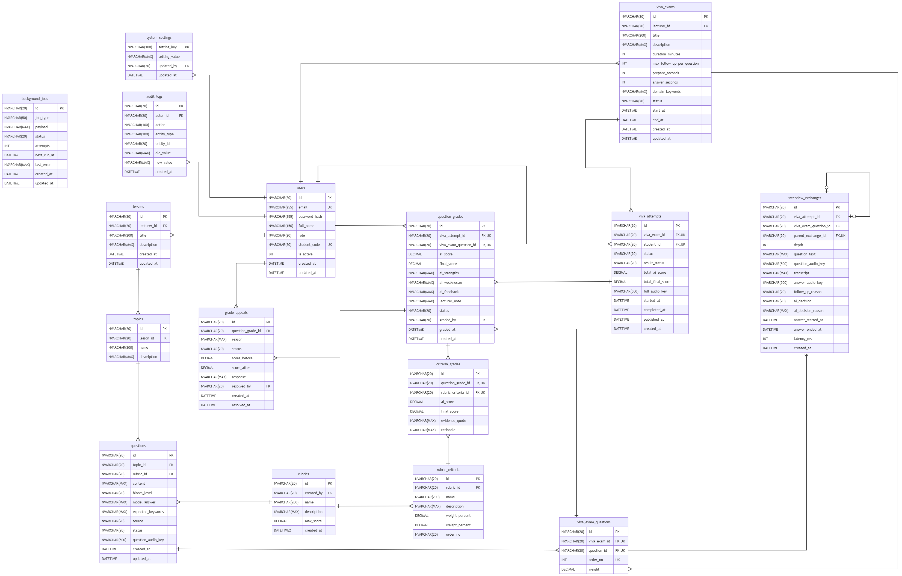

# Physical ERD - AIVES (SQL Server)

> **Mức**: Physical - bảng thật trên **Microsoft SQL Server**: tên bảng, kiểu cột, NULL, khoá, ràng buộc, index.  
> **Mã nguồn**: [physical-erd.mmd](physical-erd.mmd)  
> **Đi từ**: [02-logical-erd.md](02-logical-erd.md)

---

## 1. Sơ đồ

---

## 2. Quy ước

| Hạng mục | Quy ước | Lý do |
| :--- | :--- | :--- |
| Tên bảng / cột | `snake_case`, tên bảng số nhiều (`viva_attempts`) | Thống nhất, dễ map sang JPA |
| Khoá chính | Cột `id` kiểu `NVARCHAR(20)` | Mã dạng chuỗi (xem mục 6 - quyết định cần chốt) |
| Khoá ngoại | `<tên thực thể>_id`, cùng kiểu `NVARCHAR(20)` | Khớp kiểu với PK được tham chiếu |
| Chuỗi | `NVARCHAR(n)` / `NVARCHAR(MAX)` | Lưu đúng tiếng Việt có dấu (Unicode) |
| Enum | `NVARCHAR(20)` + `CHECK (... IN (...))` | SQL Server không có kiểu ENUM |
| Điểm số | `DECIMAL(5,2)` (thang 10) | Xem lưu ý về `DECIMAL` ở mục 5 |
| Thời gian | `DATETIME` | |
| Đúng / sai | `BIT` | |
| Xoá dữ liệu | Không dùng `ON DELETE CASCADE`; dữ liệu thi chỉ chuyển `ARCHIVED` | Tránh lỗi *multiple cascade paths* của SQL Server |
| Unique cho phép NULL | Filtered unique index `WHERE col IS NOT NULL` | SQL Server coi các NULL trong `UNIQUE` là trùng nhau |

---

## 3. Mapping Logical → Physical

| Logical | Physical | Thay đổi |
| :--- | :--- | :--- |
| `LECTURER`, `STUDENT` | `users` | Gộp 2 thực thể, thêm `role` (`ADMIN` / `LECTURER` / `STUDENT`). `student_code` chỉ có giá trị với sinh viên. |
| `<entity>_id` | `id` | Mọi bảng dùng tên PK chung là `id` |
| `attempt_id` (FK) | `viva_attempt_id` | Đổi tên cho rõ nghĩa |
| `criteria_id` (FK) | `rubric_criteria_id` | Đổi tên cho rõ nghĩa |
| `RUBRIC` | `rubrics` | Thêm `created_by`, `created_at` (cột audit, không phải quan hệ ERD) |
| `INTERVIEW_EXCHANGE` | `interview_exchanges` | Thêm `question_audio_key`, `answer_audio_key`, `ai_decision_reason`, `answer_started_at`, `answer_ended_at` |
| `QUESTION_GRADE` | `question_grades` | Thêm `ai_strengths`, `ai_weaknesses` (`BR-GRADE-001`) |
| – | `background_jobs`, `audit_logs`, `system_settings` | Bảng hệ thống mới |
| – | `created_at`, `updated_at` | Cột thời gian ở hầu hết các bảng |

---

## 4. Đặc tả bảng

### 4.1. Bảng nghiệp vụ

#### `users`

| Cột | Kiểu | NULL | Ràng buộc / Mặc định |
| :--- | :--- | :---: | :--- |
| `id` | NVARCHAR(20) | | PK |
| `email` | NVARCHAR(255) | | UNIQUE |
| `password_hash` | NVARCHAR(255) | | |
| `full_name` | NVARCHAR(150) | | |
| `role` | NVARCHAR(20) | | CHECK `ADMIN`, `LECTURER`, `STUDENT` |
| `student_code` | NVARCHAR(20) | ✓ | Filtered UNIQUE (chỉ SV có giá trị) |
| `is_active` | BIT | | DEFAULT 1 |
| `created_at` | DATETIME | | DEFAULT GETDATE() |
| `updated_at` | DATETIME | ✓ | |

#### `lessons`

| Cột | Kiểu | NULL | Ràng buộc / Mặc định |
| :--- | :--- | :---: | :--- |
| `id` | NVARCHAR(20) | | PK |
| `lecturer_id` | NVARCHAR(20) | | FK → `users.id` |
| `title` | NVARCHAR(200) | | |
| `description` | NVARCHAR(MAX) | ✓ | |
| `created_at` | DATETIME | | DEFAULT GETDATE() |
| `updated_at` | DATETIME | ✓ | |

#### `topics`

| Cột | Kiểu | NULL | Ràng buộc / Mặc định |
| :--- | :--- | :---: | :--- |
| `id` | NVARCHAR(20) | | PK |
| `lesson_id` | NVARCHAR(20) | | FK → `lessons.id` |
| `name` | NVARCHAR(200) | | |
| `description` | NVARCHAR(MAX) | ✓ | |

#### `rubrics`

| Cột | Kiểu | NULL | Ràng buộc / Mặc định |
| :--- | :--- | :---: | :--- |
| `id` | NVARCHAR(20) | | PK |
| `created_by` | NVARCHAR(20) | | FK → `users.id` |
| `name` | NVARCHAR(200) | | |
| `description` | NVARCHAR(MAX) | ✓ | |
| `max_score` | DECIMAL(5,2) | | DEFAULT 10 |
| `created_at` | DATETIME | | DEFAULT GETDATE() |

#### `rubric_criteria`

| Cột | Kiểu | NULL | Ràng buộc / Mặc định |
| :--- | :--- | :---: | :--- |
| `id` | NVARCHAR(20) | | PK |
| `rubric_id` | NVARCHAR(20) | | FK → `rubrics.id` |
| `name` | NVARCHAR(200) | | |
| `description` | NVARCHAR(MAX) | | NOT NULL (`BR-BANK-003`) |
| `weight_percent` | DECIMAL(5,2) | | CHECK `> 0 AND <= 100` |
| `order_no` | INT | | DEFAULT 1 |

#### `questions`

| Cột | Kiểu | NULL | Ràng buộc / Mặc định |
| :--- | :--- | :---: | :--- |
| `id` | NVARCHAR(20) | | PK |
| `topic_id` | NVARCHAR(20) | | FK → `topics.id` |
| `rubric_id` | NVARCHAR(20) | ✓ | FK → `rubrics.id`; NULL khi còn `DRAFT` |
| `content` | NVARCHAR(MAX) | | |
| `bloom_level` | NVARCHAR(20) | | CHECK `REMEMBER`, `UNDERSTAND`, `APPLY`, `ANALYZE` |
| `model_answer` | NVARCHAR(MAX) | ✓ | |
| `expected_keywords` | NVARCHAR(MAX) | ✓ | Mảng JSON |
| `source` | NVARCHAR(20) | | CHECK `MANUAL`, `AI_GENERATED`; DEFAULT `MANUAL` |
| `status` | NVARCHAR(20) | | CHECK `DRAFT`, `APPROVED`, `REJECTED`, `ARCHIVED`; DEFAULT `DRAFT` |
| `question_audio_key` | NVARCHAR(500) | ✓ | File TTS của câu hỏi (cache) |
| `created_at` | DATETIME | | DEFAULT GETDATE() |
| `updated_at` | DATETIME | ✓ | |

Ràng buộc bảng: `CHECK (status <> 'APPROVED' OR rubric_id IS NOT NULL)` (`BR-BANK-001`). Index: `(topic_id, status)`.

#### `viva_exams`

| Cột | Kiểu | NULL | Ràng buộc / Mặc định |
| :--- | :--- | :---: | :--- |
| `id` | NVARCHAR(20) | | PK |
| `lecturer_id` | NVARCHAR(20) | | FK → `users.id` |
| `title` | NVARCHAR(200) | | |
| `description` | NVARCHAR(MAX) | ✓ | |
| `duration_minutes` | INT | | DEFAULT 30 |
| `max_follow_up_per_question` | INT | | CHECK `BETWEEN 0 AND 5`; DEFAULT 2 |
| `prepare_seconds` | INT | | DEFAULT 30 |
| `answer_seconds` | INT | | DEFAULT 120 |
| `domain_keywords` | NVARCHAR(MAX) | ✓ | Mảng JSON (`BR-VIVA-004`) |
| `status` | NVARCHAR(20) | | CHECK `DRAFT`, `SCHEDULED`, `IN_PROGRESS`, `COMPLETED`, `ARCHIVED` |
| `start_at` | DATETIME | ✓ | |
| `end_at` | DATETIME | ✓ | |
| `created_at` | DATETIME | | DEFAULT GETDATE() |
| `updated_at` | DATETIME | ✓ | |

#### `viva_exam_questions`

| Cột | Kiểu | NULL | Ràng buộc / Mặc định |
| :--- | :--- | :---: | :--- |
| `id` | NVARCHAR(20) | | PK |
| `viva_exam_id` | NVARCHAR(20) | | FK → `viva_exams.id` |
| `question_id` | NVARCHAR(20) | | FK → `questions.id` |
| `order_no` | INT | | |
| `weight` | DECIMAL(5,2) | | DEFAULT 1 |

Ràng buộc bảng: `UNIQUE (viva_exam_id, question_id)`, `UNIQUE (viva_exam_id, order_no)`.

#### `viva_attempts`

| Cột | Kiểu | NULL | Ràng buộc / Mặc định |
| :--- | :--- | :---: | :--- |
| `id` | NVARCHAR(20) | | PK |
| `viva_exam_id` | NVARCHAR(20) | | FK → `viva_exams.id` |
| `student_id` | NVARCHAR(20) | | FK → `users.id` |
| `status` | NVARCHAR(20) | | CHECK `NOT_STARTED`, `IN_PROGRESS`, `COMPLETED`, `ABANDONED` |
| `result_status` | NVARCHAR(20) | | CHECK `NONE`, `GRADING`, `PENDING_REVIEW`, `GRADING_FAILED`, `PUBLISHED` |
| `total_ai_score` | DECIMAL(6,2) | ✓ | |
| `total_final_score` | DECIMAL(6,2) | ✓ | |
| `full_audio_key` | NVARCHAR(500) | ✓ | File ghi âm toàn bài |
| `started_at` | DATETIME | ✓ | |
| `completed_at` | DATETIME | ✓ | |
| `published_at` | DATETIME | ✓ | |
| `created_at` | DATETIME | | DEFAULT GETDATE() |

Ràng buộc bảng: `UNIQUE (viva_exam_id, student_id)` (`BR-AUTH-002`).

#### `interview_exchanges`

| Cột | Kiểu | NULL | Ràng buộc / Mặc định |
| :--- | :--- | :---: | :--- |
| `id` | NVARCHAR(20) | | PK |
| `viva_attempt_id` | NVARCHAR(20) | | FK → `viva_attempts.id` |
| `viva_exam_question_id` | NVARCHAR(20) | | FK → `viva_exam_questions.id` |
| `parent_exchange_id` | NVARCHAR(20) | ✓ | FK → `interview_exchanges.id`; Filtered UNIQUE |
| `depth` | INT | | DEFAULT 0 (0 = câu gốc) |
| `question_text` | NVARCHAR(MAX) | | |
| `question_audio_key` | NVARCHAR(500) | ✓ | |
| `transcript` | NVARCHAR(MAX) | ✓ | |
| `answer_audio_key` | NVARCHAR(500) | ✓ | |
| `follow_up_reason` | NVARCHAR(20) | ✓ | CHECK `INCOMPLETE`, `AMBIGUOUS`, `CONTRADICTORY` |
| `ai_decision` | NVARCHAR(20) | ✓ | CHECK `FOLLOW_UP`, `NEXT`, `SKIPPED` |
| `ai_decision_reason` | NVARCHAR(MAX) | ✓ | |
| `answer_started_at` | DATETIME | ✓ | |
| `answer_ended_at` | DATETIME | ✓ | |
| `latency_ms` | INT | ✓ | `BR-VIVA-003` |
| `created_at` | DATETIME | | DEFAULT GETDATE() |

Ràng buộc bảng: `CHECK ((parent_exchange_id IS NULL AND depth = 0) OR (parent_exchange_id IS NOT NULL AND depth > 0))`. Index: `(viva_attempt_id, viva_exam_question_id)`.

#### `question_grades`

| Cột | Kiểu | NULL | Ràng buộc / Mặc định |
| :--- | :--- | :---: | :--- |
| `id` | NVARCHAR(20) | | PK |
| `viva_attempt_id` | NVARCHAR(20) | | FK → `viva_attempts.id` |
| `viva_exam_question_id` | NVARCHAR(20) | | FK → `viva_exam_questions.id` |
| `ai_score` | DECIMAL(5,2) | ✓ | |
| `final_score` | DECIMAL(5,2) | ✓ | |
| `ai_strengths` | NVARCHAR(MAX) | ✓ | |
| `ai_weaknesses` | NVARCHAR(MAX) | ✓ | |
| `ai_feedback` | NVARCHAR(MAX) | ✓ | |
| `lecturer_note` | NVARCHAR(MAX) | ✓ | |
| `status` | NVARCHAR(20) | | CHECK `AI_DRAFT`, `APPROVED`, `FAILED`; DEFAULT `AI_DRAFT` |
| `graded_by` | NVARCHAR(20) | ✓ | FK → `users.id`; NULL khi chưa chốt |
| `graded_at` | DATETIME | ✓ | |
| `created_at` | DATETIME | | DEFAULT GETDATE() |

Ràng buộc bảng:

- `UNIQUE (viva_attempt_id, viva_exam_question_id)`
- `CHECK (status <> 'APPROVED' OR graded_by IS NOT NULL)`
- `CHECK (final_score IS NULL OR ai_score IS NULL OR ABS(final_score - ai_score) <= 2.0 OR lecturer_note IS NOT NULL)` (`BR-GRADE-002`)

#### `criteria_grades`

| Cột | Kiểu | NULL | Ràng buộc / Mặc định |
| :--- | :--- | :---: | :--- |
| `id` | NVARCHAR(20) | | PK |
| `question_grade_id` | NVARCHAR(20) | | FK → `question_grades.id` |
| `rubric_criteria_id` | NVARCHAR(20) | | FK → `rubric_criteria.id` |
| `ai_score` | DECIMAL(5,2) | ✓ | |
| `final_score` | DECIMAL(5,2) | ✓ | |
| `evidence_quote` | NVARCHAR(MAX) | ✓ | `BR-GRADE-001` |
| `rationale` | NVARCHAR(MAX) | ✓ | |

Ràng buộc bảng: `UNIQUE (question_grade_id, rubric_criteria_id)`.

#### `grade_appeals`

| Cột | Kiểu | NULL | Ràng buộc / Mặc định |
| :--- | :--- | :---: | :--- |
| `id` | NVARCHAR(20) | | PK |
| `question_grade_id` | NVARCHAR(20) | | FK → `question_grades.id` |
| `reason` | NVARCHAR(MAX) | | |
| `status` | NVARCHAR(20) | | CHECK `PENDING`, `ACCEPTED`, `REJECTED`; DEFAULT `PENDING` |
| `score_before` | DECIMAL(5,2) | | |
| `score_after` | DECIMAL(5,2) | ✓ | |
| `response` | NVARCHAR(MAX) | ✓ | |
| `resolved_by` | NVARCHAR(20) | ✓ | FK → `users.id`; NULL khi đang chờ |
| `created_at` | DATETIME | | DEFAULT GETDATE() |
| `resolved_at` | DATETIME | ✓ | |

Ràng buộc bảng: `CHECK (status = 'PENDING' OR resolved_by IS NOT NULL)`. Filtered UNIQUE `(question_grade_id) WHERE status = 'PENDING'` để mỗi điểm câu chỉ có 1 đơn đang chờ.

### 4.2. Bảng hệ thống

| Bảng | Mục đích | Cột chính |
| :--- | :--- | :--- |
| `background_jobs` | Hàng đợi việc chạy ngầm trong BE (chấm điểm AI sau khi thi xong, xử lý audio). Job được ghi cùng transaction nghiệp vụ nên không mất khi server khởi động lại. | `job_type` (`EVALUATE_ATTEMPT`, `AUDIO_UPLOAD`), `payload` (JSON), `status` (`PENDING`, `RUNNING`, `DONE`, `FAILED`), `attempts`, `next_run_at`, `last_error`. Index `(status, next_run_at)`. |
| `audit_logs` | Vết thao tác quan trọng: ghi đè điểm, công bố kết quả, duyệt câu hỏi, xử lý phúc khảo. | `actor_id` → `users.id`, `action`, `entity_type`, `entity_id`, `old_value`, `new_value`. Index `(entity_type, entity_id)`. |
| `system_settings` | Cấu hình dạng key - value: model AI, ngôn ngữ STT, giọng TTS... | `setting_key` (PK), `setting_value`, `updated_by` → `users.id`. |

---

## 5. Lưu ý kiểu dữ liệu

- **`DECIMAL` phải ghi rõ độ chính xác.** Trên SQL Server, `DECIMAL` không kèm tham số mặc định là `DECIMAL(18,0)`, tức **không có phần thập phân**: điểm 7.5 sẽ bị làm tròn thành 8. Vì vậy script tạo bảng phải dùng `DECIMAL(5,2)` cho điểm và trọng số, `DECIMAL(6,2)` cho tổng điểm. Trên hình chỉ ghi `DECIMAL` vì Mermaid không cho dấu phẩy trong kiểu dữ liệu.
- **`NVARCHAR` thay vì `VARCHAR`** để lưu đúng tiếng Việt. Khi dùng JPA, bật `hibernate.use_nationalized_character_data=true`.
- **Khoá ngoại phải cùng kiểu với khoá chính** được tham chiếu (`NVARCHAR(20)`), nếu không SQL Server sẽ báo lỗi khi tạo FK.

---

## 6. Quyết định cần chốt

- **Kiểu khoá chính `NVARCHAR(20)`**: SQL Server không tự sinh giá trị cho cột chuỗi như `IDENTITY`, nên BE phải tự sinh mã (ví dụ `LSN00001`). Nếu nhóm định dùng UUID thì `NVARCHAR(20)` không đủ độ dài (UUID dài 36 ký tự); khi đó nên đổi sang `UNIQUEIDENTIFIER`. Nếu không cần mã dạng chuỗi, `BIGINT IDENTITY(1,1)` là cách đơn giản nhất.
- **`DATETIME` hay `DATETIME2`**: nên dùng thống nhất một loại cho mọi bảng.

---

## 7. Điểm cần sửa trên hình `physical-erd.png`

File `physical-erd.mmd` đã sửa sẵn các lỗi này; chỉ cần xuất lại ảnh:

| Bảng | Trên hình | Sửa thành |
| :--- | :--- | :--- |
| `rubric_criteria` | Cột `weight_percent` bị lặp 2 lần | Giữ 1 cột `weight_percent DECIMAL` |
| `rubric_criteria` | `order_no NVARCHAR(20)` | `order_no INT` (dùng để sắp xếp) |
| `rubrics` | `created_at DATETIME2` | `DATETIME` cho thống nhất với các bảng khác |
| `rubrics` | Có cột `created_by FK` nhưng không có đường nối tới `users` | Thêm quan hệ `users \|\|--o{ rubrics` |
