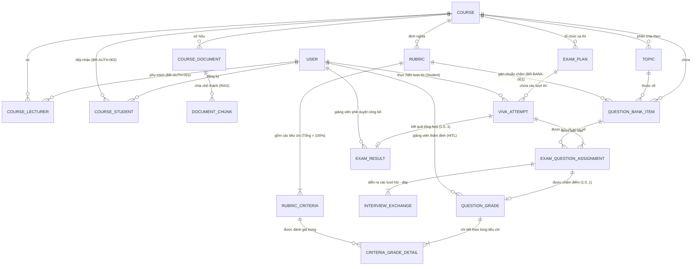

# Conceptual Entity Relationship Diagram (Conceptual ERD) - AIVES

> **Tài liệu**: Conceptual ERD cho Hệ thống Thi Vấn Đáp Thông Minh Ứng Dụng AI (AIVES)  
> **Mục đích**: Mô hình hóa các thực thể dữ liệu ở tầng quan niệm (Conceptual Level), định nghĩa ranh giới các miền dữ liệu (Domains/Modules), thuộc tính đặc trưng và các mối quan hệ (cardinality) theo toàn bộ Business Rules (BR) và Architecture Design của hệ thống.

---

## 1. Sơ đồ Conceptual ERD (Mermaid)

---

## 2. Giải thích Các Thực Thể Chính Theo 5 Miền Nghiệp Vụ

### Miền 1: Quản Trị & Phân Quyền (Auth & RBAC)

- **`USER`**: Người dùng trong hệ thống (Admin, Giảng viên, Sinh viên).
- **`COURSE`**: Môn học trong chương trình đào tạo. Là đơn vị ranh giới bảo mật cấp dữ liệu.
- **`COURSE_LECTURER`**: Phân công giảng viên vào môn học theo quy tắc **`BR-AUTH-001`** (chỉ được quản lý câu hỏi, rubric và chấm thi môn được giao).
- **`COURSE_STUDENT`**: Danh sách sinh viên đủ điều kiện tham gia môn học (**`BR-AUTH-002`**).

### Miền 2: Ngân Hàng Câu Hỏi & Rubric (Question Bank & Rubric)

- **`COURSE_DOCUMENT`**: Giáo trình, slide, tài liệu học tập của môn học.
- **`DOCUMENT_CHUNK`**: Các phân đoạn tri thức tài liệu phục vụ AI RAG sinh câu hỏi và truy xuất kiến thức.
- **`TOPIC`**: Chủ đề kiến thức trong môn học để phân loại câu hỏi.
- **`RUBRIC`**: Bộ tiêu chí chấm điểm của môn học.
- **`RUBRIC_CRITERIA`**: Các tiêu chí chi tiết cấu thành Rubric (**`BR-BANK-001`**, **`BR-BANK-003`**).
- **`QUESTION_BANK_ITEM`**: Câu hỏi trong ngân hàng đề (gồm câu AI sinh và Giảng viên tạo, liên kết chuẩn Rubric theo **`BR-BANK-002`**).

### Miền 3: Đợt Thi & Ca Thi (Exam Scheduling & Session)

- **`EXAM_PLAN`**: Kế hoạch tổ chức đợt thi môn học, quy định số câu chính và trần hỏi xoáy tối đa.
- **`VIVA_ATTEMPT`**: Lượt thi vấn đáp cụ thể của một sinh viên, quản lý vòng đời phiên thi và bản ghi âm.
- **`EXAM_QUESTION_ASSIGNMENT`**: Đề thi được bốc riêng cho sinh viên trong từng lượt thi.

### Miền 4: Tương Tác Vấn Đáp Trực Tiếp (Real-Time Viva Interaction)

- **`INTERVIEW_EXCHANGE`**: Từng lượt trao đổi hỏi - đáp trực tiếp giữa AI và thí sinh (phân định câu hỏi chính, câu hỏi xoáy, transcript và lý do kích hoạt hỏi xoáy theo **`BR-VIVA-001`**, **`BR-VIVA-002`**).

### Miền 5: Chấm Điểm AI & Giảng Viên Thẩm Định (AI Scoring & HITL Review)

- **`QUESTION_GRADE`**: Điểm số và lý giải chấm cho từng câu hỏi thi (sinh sau khi hoàn thành phản hồi, hỗ trợ Giảng viên thẩm định/ghi đè theo **`BR-GRADE-002`**).
- **`CRITERIA_GRADE_DETAIL`**: Điểm chi tiết cho từng tiêu chí Rubric kèm trích dẫn bằng chứng từ transcript (**`BR-GRADE-001`**).
- **`EXAM_RESULT`**: Bảng điểm tổng kết ca thi, trải qua quy trình Human-in-the-Loop trước khi công bố cho sinh viên (**`BR-GRADE-003`**).

---

## 3. Ma Trận Quan Hệ Giữa Các Thực Thể (Cardinality Matrix)

| Thực thể nguồn | Ký hiệu Crow's Foot | Thực thể đích | Ràng buộc nghiệp vụ liên quan |
| :--- | :---: | :--- | :--- |
| `USER` | `\|\|--o{` | `COURSE_LECTURER` | Giảng viên được phân công phụ trách các môn học (`BR-AUTH-001`) |
| `COURSE` | `\|\|--o{` | `COURSE_LECTURER` | Môn học có danh sách giảng viên phụ trách |
| `USER` | `\|\|--o{` | `COURSE_STUDENT` | Sinh viên đăng ký tham gia môn học |
| `COURSE` | `\|\|--o{` | `COURSE_STUDENT` | Môn học tiếp nhận sinh viên theo học (`BR-AUTH-002`) |
| `COURSE` | `\|\|--o{` | `COURSE_DOCUMENT` | Môn học sở hữu tài liệu tham khảo |
| `COURSE_DOCUMENT` | `\|\|--o{` | `DOCUMENT_CHUNK` | Tài liệu được chia thành các đoạn chunk phục vụ RAG |
| `COURSE` | `\|\|--o{` | `TOPIC` | Môn học phân chia thành các chủ đề kiến thức |
| `COURSE` | `\|\|--o{` | `RUBRIC` | Môn học định nghĩa các rubric chuẩn |
| `RUBRIC` | `\|\|--\|{` | `RUBRIC_CRITERIA` | Một rubric có 1 hoặc nhiều tiêu chí ($\sum \text{weight} = 100\%$) |
| `COURSE` | `\|\|--o{` | `QUESTION_BANK_ITEM` | Môn học chứa ngân hàng câu hỏi |
| `TOPIC` | `\|\|--o{` | `QUESTION_BANK_ITEM` | Câu hỏi thuộc về chủ đề kiến thức |
| `RUBRIC` | `\|\|--o{` | `QUESTION_BANK_ITEM` | Câu hỏi liên kết với rubric chuẩn chấm (`BR-BANK-001`) |
| `COURSE` | `\|\|--o{` | `EXAM_PLAN` | Môn học tổ chức các đợt thi |
| `EXAM_PLAN` | `\|\|--o{` | `VIVA_ATTEMPT` | Đợt thi chứa các lượt thi vấn đáp |
| `USER` | `\|\|--o{` | `VIVA_ATTEMPT` | Sinh viên thực hiện lượt thi |
| `VIVA_ATTEMPT` | `\|\|--\|{` | `EXAM_QUESTION_ASSIGNMENT` | Lượt thi được bốc và phân bổ các câu hỏi thi |
| `QUESTION_BANK_ITEM` | `\|\|--o{` | `EXAM_QUESTION_ASSIGNMENT` | Câu hỏi ngân hàng được bốc vào đề thi sinh viên |
| `EXAM_QUESTION_ASSIGNMENT` | `\|\|--\|{` | `INTERVIEW_EXCHANGE` | Câu hỏi gồm câu chính và các lượt hỏi xoáy (`BR-VIVA-001`) |
| `EXAM_QUESTION_ASSIGNMENT` | `\|\|--o\|` | `QUESTION_GRADE` | Mỗi câu hỏi được sinh bản ghi điểm sau khi thi (`1 : 0..1`) |
| `QUESTION_GRADE` | `\|\|--\|{` | `CRITERIA_GRADE_DETAIL` | Điểm mỗi câu được chi tiết hóa theo tiêu chí (`BR-GRADE-001`) |
| `RUBRIC_CRITERIA` | `\|\|--o{` | `CRITERIA_GRADE_DETAIL` | Tiêu chí Rubric được đánh giá chi tiết trong điểm thi |
| `USER` | `\|\|--o{` | `QUESTION_GRADE` | Giảng viên thẩm định và duyệt điểm (`HITL`) |
| `VIVA_ATTEMPT` | `\|\|--o\|` | `EXAM_RESULT` | Lượt thi tổng hợp thành kết quả sau khi hoàn tất (`1 : 0..1`) |
| `USER` | `\|\|--o{` | `EXAM_RESULT` | Giảng viên phê duyệt và công bố bảng điểm (`HITL`) |\|--o\|`     | `EVALUATION`           | Lượt tương tác được đánh giá sau khi kết thúc phản hồi (1 : 0..1)      |
| `RUBRIC_CRITERIA`      |     `\|\|--o{`      | `CRITERIA_EVALUATION`  | Tiêu chí làm chuẩn đo lường các đánh giá                               |
| `EVALUATION`           |     `\|\|--\|{`     | `CRITERIA_EVALUATION`  | Đánh giá được chi tiết hóa theo các tiêu chí                           |
| `USER`                 |     `\|\|--o{`      | `EVALUATION`           | Giảng viên thẩm định, điều chỉnh đánh giá (HITL)                       |
| `USER`                 |     `\|\|--o{`      | `EXAM_RESULT`          | Giảng viên duyệt và công bố bảng điểm tổng kết (HITL)                  |
