# Conceptual Entity Relationship Diagram (Conceptual ERD) - AIVES

> **Tài liệu**: Conceptual ERD cho Hệ thống Thi Vấn Đáp Thông Minh Ứng Dụng AI (AIVES)  
> **Mục đích**: Mô hình hóa các thực thể dữ liệu ở tầng quan niệm (Conceptual Level), định nghĩa ranh giới các miền dữ liệu (Domains/Modules), thuộc tính đặc trưng và các mối quan hệ (cardinality) theo toàn bộ Business Rules (BR) và Architecture Design của hệ thống.

---

## 1. Sơ đồ Conceptual ERD (Mermaid)

```mermaid
erDiagram
    %% ==========================================
    %% DOMAIN 1: AUTH & RBAC (BR-AUTH)
    %% ==========================================
    USER {
        UUID id
        string email
        string full_name
        string role "ADMIN | LECTURER | STUDENT"
        string status "ACTIVE | INACTIVE"
    }

    COURSE {
        UUID id
        string code "e.g. SWD392"
        string name
        string description
        string status "ACTIVE | ARCHIVED"
    }

    COURSE_LECTURER {
        UUID id
        UUID course_id FK
        UUID lecturer_id FK
        string role_in_course "COORDINATOR | EXAMINER"
    }

    COURSE_STUDENT {
        UUID id
        UUID course_id FK
        UUID student_id FK
        string enrollment_status "ENROLLED | COMPLETED | DROPPED"
    }

    %% ==========================================
    %% DOMAIN 2: QUESTION BANK & RUBRIC (BR-BANK)
    %% ==========================================
    COURSE_DOCUMENT {
        UUID id
        UUID course_id FK
        string file_name
        string file_url
        string parse_status "PARSED | FAILED | PENDING"
        timestamp uploaded_at
    }

    DOCUMENT_CHUNK {
        UUID id
        UUID document_id FK
        text content
        vector embedding "Vector 1536d / pgvector"
        json metadata
    }

    TOPIC {
        UUID id
        UUID course_id FK
        string name
        string description
    }

    RUBRIC {
        UUID id
        UUID course_id FK
        string name
        decimal max_score "Default 10.0"
        string status "DRAFT | ACTIVE | ARCHIVED"
    }

    RUBRIC_CRITERIA {
        UUID id
        UUID rubric_id FK
        string name
        text description "Yêu cầu đạt điểm chuẩn xác"
        decimal weight_percentage "Tổng = 100%"
        decimal max_points
    }

    QUESTION_BANK_ITEM {
        UUID id
        UUID course_id FK
        UUID topic_id FK
        UUID rubric_id FK
        text content "Nội dung câu hỏi"
        string bloom_level "REMEMBER | UNDERSTAND | APPLY | ANALYZE"
        string source "AI_GENERATED | MANUAL"
        text model_answer "Ý chính / keywords cần đạt"
        string status "DRAFT | APPROVED | ARCHIVED"
    }

    %% ==========================================
    %% DOMAIN 3: EXAM SCHEDULING & SESSION (BR-SESSION)
    %% ==========================================
    EXAM_PLAN {
        UUID id
        UUID course_id FK
        string title
        timestamp start_time
        timestamp end_time
        int total_questions "Số câu chính mỗi lượt"
        int max_follow_up_per_q "Trần hỏi xoáy (BR-VIVA-001)"
        int preparation_seconds
        int answer_seconds
        string status "SCHEDULED | ONGOING | CLOSED"
    }

    VIVA_ATTEMPT {
        UUID id
        UUID exam_plan_id FK
        UUID student_id FK
        timestamp started_at
        timestamp completed_at
        string session_status "NOT_STARTED | IN_PROGRESS | COMPLETED | ABANDONED"
        string audio_recording_url "MinIO/S3 audio file"
    }

    EXAM_QUESTION_ASSIGNMENT {
        UUID id
        UUID viva_attempt_id FK
        UUID question_id FK
        int display_order
    }

    %% ==========================================
    %% DOMAIN 4: REAL-TIME VIVA INTERACTION (BR-VIVA)
    %% ==========================================
    INTERVIEW_EXCHANGE {
        UUID id
        UUID assignment_id FK
        string exchange_type "MAIN_QUESTION | FOLLOW_UP"
        int sequence_number
        text question_text
        text answer_transcript "Transcript STT câu trả lời"
        string audio_chunk_url
        string trigger_reason "INCOMPLETE | AMBIGUOUS | CONTRADICTORY | NONE"
        timestamp asked_at
        timestamp answered_at
    }

    %% ==========================================
    %% DOMAIN 5: AI GRADING & HITL REVIEW (BR-GRADE)
    %% ==========================================
    QUESTION_GRADE {
        UUID id
        UUID assignment_id FK
        decimal ai_suggested_score
        decimal final_score
        string grading_status "AI_DRAFT | APPROVED | OVERRIDDEN"
        text ai_strengths_rationale
        text ai_weaknesses_rationale
        text lecturer_note
        UUID reviewed_by_lecturer_id FK
        timestamp reviewed_at
    }

    CRITERIA_GRADE_DETAIL {
        UUID id
        UUID question_grade_id FK
        UUID rubric_criteria_id FK
        decimal ai_score
        decimal final_score
        text evidence_quote "Trích dẫn từ transcript"
    }

    EXAM_RESULT {
        UUID id
        UUID viva_attempt_id FK
        decimal total_score "Tổng điểm cuối cùng"
        string publish_status "PENDING_REVIEW | PUBLISHED"
        UUID published_by FK
        timestamp published_at
    }

    %% ==========================================
    %% RELATIONSHIPS & CARDINALITY
    %% ==========================================
    USER ||--o{ COURSE_LECTURER : "phụ trách (BR-AUTH-001)"
    COURSE ||--o{ COURSE_LECTURER : "có"
    USER ||--o{ COURSE_STUDENT : "đăng ký"
    COURSE ||--o{ COURSE_STUDENT : "tiếp nhận"

    COURSE ||--o{ COURSE_DOCUMENT : "sở hữu"
    COURSE_DOCUMENT ||--o{ DOCUMENT_CHUNK : "chia nhỏ thành (RAG)"
    COURSE ||--o{ TOPIC : "phân chia theo"
    COURSE ||--o{ RUBRIC : "định nghĩa"
    RUBRIC ||--|{ RUBRIC_CRITERIA : "gồm các tiêu chí (Tổng weight = 100%)"

    COURSE ||--o{ QUESTION_BANK_ITEM : "chứa"
    TOPIC ||--o{ QUESTION_BANK_ITEM : "thuộc về"
    RUBRIC ||--o{ QUESTION_BANK_ITEM : "gán chuẩn chấm (BR-BANK-001)"

    COURSE ||--o{ EXAM_PLAN : "tổ chức ca thi"
    EXAM_PLAN ||--o{ VIVA_ATTEMPT : "chứa các lượt thi"
    USER ||--o{ VIVA_ATTEMPT : "thực hiện lượt thi (Student)"

    VIVA_ATTEMPT ||--|{ EXAM_QUESTION_ASSIGNMENT : "được bốc đề phân bổ"
    QUESTION_BANK_ITEM ||--o{ EXAM_QUESTION_ASSIGNMENT : "được bốc vào"

    EXAM_QUESTION_ASSIGNMENT ||--|{ INTERVIEW_EXCHANGE : "diễn ra các lượt hỏi - đáp"
    EXAM_QUESTION_ASSIGNMENT ||--|| QUESTION_GRADE : "được chấm điểm (1:1)"
    QUESTION_GRADE ||--|{ CRITERIA_GRADE_DETAIL : "chi tiết theo từng tiêu chí"
    RUBRIC_CRITERIA ||--o{ CRITERIA_GRADE_DETAIL : "được đánh giá trong"

    USER ||--o{ QUESTION_GRADE : "giảng viên thẩm định (HITL)"
    VIVA_ATTEMPT ||--|| EXAM_RESULT : "kết quả tổng hợp (1:1)"
    USER ||--o{ EXAM_RESULT : "giảng viên phê duyệt công bố"
```

---

## 2. Giải thích Các Thực Thể Chính Theo 5 Miền Nghiệp Vụ

### Miền 1: Quản Trị & Phân Quyền (Auth & RBAC)
* **`USER`**: Lưu trữ người dùng hệ thống gồm 3 vai trò chính: `ADMIN`, `LECTURER`, `STUDENT`.
* **`COURSE`**: Môn học (vd: `SWD392 - Software Architecture & Design`). Là đơn vị ranh giới bảo mật cấp dữ liệu.
* **`COURSE_LECTURER`**: Bảng phân công giảng viên vào môn học. Triển khai quy tắc **`BR-AUTH-001`**: Giảng viên chỉ được quản lý câu hỏi, rubric và chấm thi môn mình được giao.
* **`COURSE_STUDENT`**: Danh sách sinh viên đủ điều kiện tham gia môn học (đối chiếu quy tắc **`BR-AUTH-002`**).

### Miền 2: Ngân Hàng Câu Hỏi & Rubric (Question Bank & Rubric)
* **`COURSE_DOCUMENT` & `DOCUMENT_CHUNK`**: Lưu trữ tài liệu (giáo trình, slide) và các vector embeddings (lưu trong `PostgreSQL + pgvector`) phục vụ AI RAG sinh câu hỏi.
* **`RUBRIC` & `RUBRIC_CRITERIA`**: Bộ tiêu chí chấm điểm. Quy tắc **`BR-BANK-001`** & **`BR-BANK-003`** bắt buộc tổng `weight_percentage` của các tiêu chí phải bằng $100\%$ và có mô tả chuẩn làm căn cứ cho AI.
* **`QUESTION_BANK_ITEM`**: Câu hỏi ngân hàng. Bắt buộc liên kết với 1 `Rubric`. Thuộc tính `source` phân biệt câu do AI sinh (`AI_GENERATED`) hay thủ công (`MANUAL`), trạng thái `DRAFT` $\rightarrow$ `APPROVED` (bắt buộc qua Giảng viên duyệt theo **`BR-BANK-002`**).

### Miền 3: Đợt Thi & Phiên Thi (Exam Scheduling & Session)
* **`EXAM_PLAN`**: Đợt thi/kỳ thi của môn học, thiết lập số lượng câu hỏi chính, trần hỏi xoáy tối đa mỗi câu (`max_follow_up_per_q`), giới hạn thời gian trả lời.
* **`VIVA_ATTEMPT`**: Lượt thi cụ thể của một sinh viên. Quản lý trạng thái (`NOT_STARTED`, `IN_PROGRESS`, `COMPLETED`), đường dẫn file ghi âm gốc trên MinIO/S3 phục vụ lưu vết và thẩm định.
* **`EXAM_QUESTION_ASSIGNMENT`**: Đề thi được bốc riêng cho sinh viên trong lượt thi (chống trùng đề và đảm bảo thứ tự câu hỏi).

### Miền 4: Tương Tác Vấn Đáp Trực Tiếp (Real-Time Viva Interaction)
* **`INTERVIEW_EXCHANGE`**: Từng lượt trao đổi hỏi - đáp giữa AI và sinh viên.
  * Phân biệt câu hỏi chính (`MAIN_QUESTION`) và câu hỏi hỏi xoáy (`FOLLOW_UP`).
  * Lưu trữ `trigger_reason`: Lý do AI quyết định hỏi xoáy (`INCOMPLETE`, `AMBIGUOUS`, `CONTRADICTORY`) theo **`BR-VIVA-001`** và **`BR-VIVA-002`**.
  * Lưu trữ `answer_transcript` bóc băng từ STT làm căn cứ cho bước chấm điểm.

### Miền 5: Chấm Điểm AI & Giảng Viên Thẩm Định (AI Scoring & HITL Review)
* **`QUESTION_GRADE`**: Điểm số cho từng câu hỏi.
  * Lưu cả điểm đề xuất của AI (`ai_suggested_score`) và điểm chốt cuối cùng (`final_score`).
  * Trạng thái `AI_DRAFT` $\rightarrow$ `APPROVED` / `OVERRIDDEN`.
  * Thuộc tính giải trình: `ai_strengths_rationale`, `ai_weaknesses_rationale`, `lecturer_note` (bắt buộc nhập nếu Giảng viên sửa lệch $>2.0$ điểm theo **`BR-GRADE-002`**).
* **`CRITERIA_GRADE_DETAIL`**: Điểm chi tiết cho từng tiêu chí trong Rubric kèm trích dẫn bằng chứng (`evidence_quote`) từ transcript (tuân thủ **`BR-GRADE-001`**).
* **`EXAM_RESULT`**: Bảng điểm tổng kết ca thi. Trạng thái `PENDING_REVIEW` $\rightarrow$ `PUBLISHED`. Điểm số chỉ hiển thị cho sinh viên khi chuyển sang `PUBLISHED` (nguyên tắc **HITL - Human-in-the-Loop**).

---

## 3. Ma Trận Quan Hệ Giữa Các Thực Thể (Cardinality Matrix)

| Thực thể nguồn | Mối quan hệ | Thực thể đích | Ràng buộc nghiệp vụ liên quan |
| :--- | :---: | :--- | :--- |
| `COURSE` | `1 : N` | `RUBRIC` | Một môn học có nhiều rubric chuẩn |
| `RUBRIC` | `1 : N` | `RUBRIC_CRITERIA` | Một rubric có nhiều tiêu chí ($\sum \text{weight} = 100\%$) |
| `RUBRIC` | `1 : N` | `QUESTION_BANK_ITEM` | Một câu hỏi bắt buộc liên kết với 1 rubric (`BR-BANK-001`) |
| `QUESTION_BANK_ITEM` | `1 : N` | `EXAM_QUESTION_ASSIGNMENT` | Câu hỏi ngân hàng được bốc vào đề thi sinh viên |
| `VIVA_ATTEMPT` | `1 : N` | `EXAM_QUESTION_ASSIGNMENT` | Một lượt thi có nhiều câu hỏi (theo cấu hình `EXAM_PLAN`) |
| `EXAM_QUESTION_ASSIGNMENT` | `1 : N` | `INTERVIEW_EXCHANGE` | Một câu hỏi gồm 1 câu hỏi chính và $\le N$ lượt hỏi xoáy (`BR-VIVA-001`) |
| `EXAM_QUESTION_ASSIGNMENT` | `1 : 1` | `QUESTION_GRADE` | Mỗi câu hỏi thi có đúng 1 bản ghi điểm |
| `QUESTION_GRADE` | `1 : N` | `CRITERIA_GRADE_DETAIL` | Điểm mỗi câu được chi tiết hóa theo các tiêu chí rubric (`BR-GRADE-001`) |
| `VIVA_ATTEMPT` | `1 : 1` | `EXAM_RESULT` | Mỗi lượt thi tổng hợp thành 1 kết quả thi duy nhất (`BR-GRADE-003`) |
| `USER (Lecturer)` | `1 : N` | `QUESTION_GRADE` | Giảng viên thẩm định và duyệt điểm (`HITL`) |
