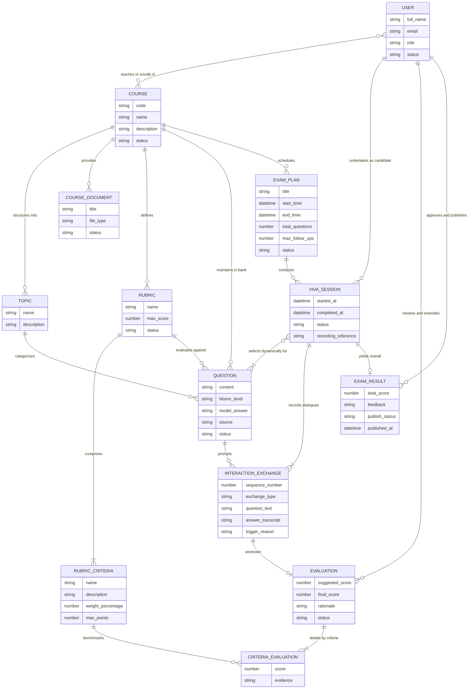

# Conceptual Entity Relationship Diagram (Conceptual ERD) - AIVES

> **Tài liệu**: Conceptual ERD cho Hệ thống Thi Vấn Đáp Thông Minh Ứng Dụng AI (AIVES)  
> **Mục đích**: Mô hình hóa các thực thể dữ liệu ở tầng quan niệm (Conceptual Level), định nghĩa ranh giới các miền dữ liệu (Domains/Modules), thuộc tính đặc trưng và các mối quan hệ (cardinality) theo toàn bộ Business Rules (BR) và Architecture Design của hệ thống.

---

## 1. Sơ đồ Conceptual ERD (Mermaid)

---

## 2. Giải thích Các Thực Thể Chính Theo 5 Miền Nghiệp Vụ

### Miền 1: Quản Trị & Phân Quyền (Auth & RBAC)

- **`USER`**: Người dùng trong hệ thống (Admin, Giảng viên, Sinh viên).
- **`COURSE`**: Môn học trong chương trình đào tạo. Mối quan hệ nhiều - nhiều bản thể (`N:N`) trực tiếp với `USER` thể hiện việc Giảng viên phụ trách giảng dạy và Sinh viên theo học.

### Miền 2: Ngân Hàng Câu Hỏi & Rubric (Question Bank & Rubric)

- **`COURSE_DOCUMENT`**: Giáo trình, bài giảng và tài liệu học tập của môn học.
- **`TOPIC`**: Chủ đề kiến thức trong môn học để phân loại câu hỏi.
- **`RUBRIC` & `RUBRIC_CRITERIA`**: Bộ tiêu chí đánh giá chuẩn hóa được gắn với môn học và từng câu hỏi.
- **`QUESTION`**: Câu hỏi trong ngân hàng đề, phân định độ khó, nguồn gốc (AI sinh hoặc Giảng viên tạo) và đáp án tham chiếu.

### Miền 3: Đợt Thi & Phiên Thi (Exam Scheduling & Session)

- **`EXAM_PLAN`**: Kế hoạch tổ chức đợt thi với cấu hình thời gian và số lượng câu hỏi.
- **`VIVA_SESSION`**: Phiên thi vấn đáp trực tiếp của sinh viên. Bốc câu hỏi động từ ngân hàng (`QUESTION`) theo quan hệ nhiều - nhiều (`N:N`).

### Miền 4: Tương Tác Vấn Đáp Trực Tiếp (Real-Time Viva Interaction)

- **`INTERACTION_EXCHANGE`**: Các lượt trao đổi đối thoại trực tiếp (câu hỏi chính và các câu hỏi đào sâu/hỏi xoáy kèm transcript câu trả lời).

### Miền 5: Đánh Giá & Thẩm Định Điểm (Evaluation & HITL Review)

- **`EVALUATION` & `CRITERIA_EVALUATION`**: Kết quả đánh giá từng lượt hỏi đáp theo tiêu chí Rubric, được sinh sau khi sinh viên hoàn thành tương tác (quan hệ `1 : 0..1`).
- **`EXAM_RESULT`**: Kết quả tổng hợp cuối cùng của phiên thi, trải qua thẩm định của Giảng viên (HITL) trước khi công bố (quan hệ `1 : 0..1`).

---

## 3. Ma Trận Quan Hệ Giữa Các Thực Thể (Cardinality Matrix)

| Thực thể nguồn         | Ký hiệu Crow's Foot | Thực thể đích          | Ý nghĩa nghiệp vụ                                                      |
| :--------------------- | :-----------------: | :--------------------- | :--------------------------------------------------------------------- |
| `USER`                 |      `}o--o{`       | `COURSE`               | Người dùng phụ trách giảng dạy hoặc đăng ký học môn học (N:N bản thể)  |
| `COURSE`               |     `\|\|--o{`      | `TOPIC`                | Môn học chia thành các chủ đề kiến thức                                |
| `COURSE`               |     `\|\|--o{`      | `COURSE_DOCUMENT`      | Môn học cung cấp các tài liệu học tập                                  |
| `COURSE`               |     `\|\|--o{`      | `RUBRIC`               | Môn học định nghĩa các rubric chuẩn                                    |
| `COURSE`               |     `\|\|--o{`      | `QUESTION`             | Môn học duy trì ngân hàng câu hỏi                                      |
| `COURSE`               |     `\|\|--o{`      | `EXAM_PLAN`            | Môn học lên lịch các đợt thi                                           |
| `RUBRIC`               |     `\|\|--\|{`     | `RUBRIC_CRITERIA`      | Một rubric bao gồm 1 hoặc nhiều tiêu chí đánh giá                      |
| `TOPIC`                |     `\|\|--o{`      | `QUESTION`             | Chủ đề phân loại các câu hỏi                                           |
| `RUBRIC`               |     `\|\|--o{`      | `QUESTION`             | Rubric được dùng làm căn cứ đánh giá cho câu hỏi                       |
| `EXAM_PLAN`            |     `\|\|--o{`      | `VIVA_SESSION`         | Đợt thi tổ chức các phiên thi vấn đáp                                  |
| `USER`                 |     `\|\|--o{`      | `VIVA_SESSION`         | Sinh viên thực hiện phiên thi vấn đáp                                  |
| `VIVA_SESSION`         |      `}o--\|{`      | `QUESTION`             | Phiên thi bốc chọn động các câu hỏi từ ngân hàng (N:N bản thể)         |
| `VIVA_SESSION`         |     `\|\|--\|{`     | `INTERACTION_EXCHANGE` | Phiên thi ghi nhận các lượt đối thoại hỏi - đáp                        |
| `QUESTION`             |     `\|\|--o{`      | `INTERACTION_EXCHANGE` | Câu hỏi gợi mở/dẫn dắt các lượt tương tác                              |
| `VIVA_SESSION`         |     `\|\|--o\|`     | `EXAM_RESULT`          | Phiên thi tạo ra 0 hoặc 1 kết quả tổng hợp sau khi hoàn tất (1 : 0..1) |
| `INTERACTION_EXCHANGE` |     `\|\|--o\|`     | `EVALUATION`           | Lượt tương tác được đánh giá sau khi kết thúc phản hồi (1 : 0..1)      |
| `RUBRIC_CRITERIA`      |     `\|\|--o{`      | `CRITERIA_EVALUATION`  | Tiêu chí làm chuẩn đo lường các đánh giá                               |
| `EVALUATION`           |     `\|\|--\|{`     | `CRITERIA_EVALUATION`  | Đánh giá được chi tiết hóa theo các tiêu chí                           |
| `USER`                 |     `\|\|--o{`      | `EVALUATION`           | Giảng viên thẩm định, điều chỉnh đánh giá (HITL)                       |
| `USER`                 |     `\|\|--o{`      | `EXAM_RESULT`          | Giảng viên duyệt và công bố bảng điểm tổng kết (HITL)                  |
