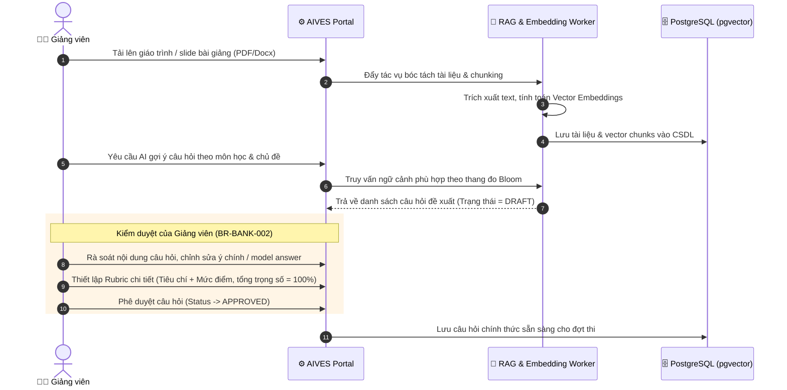
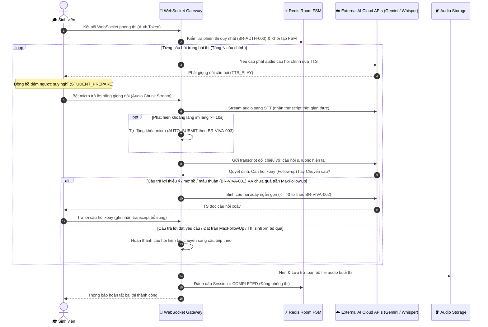
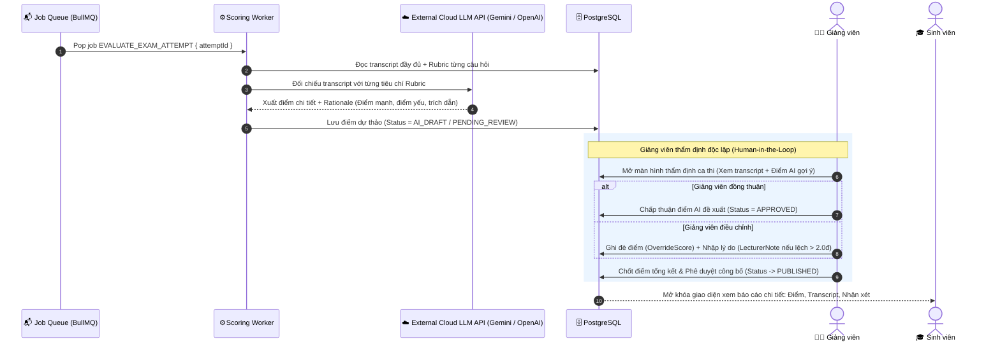

# Workflows Identification & Specification: AIVES

> **Tài liệu**: Xác định và đặc tả 3 quy trình công việc cốt lõi (Identify 3 Core Workflows) cho Hệ thống Thi Vấn Đáp Thông Minh Ứng Dụng AI (AIVES).  
> **Căn cứ**: Dựa trên [00-overview](file:///c:/Edisk/dow/Tai_lieu/ky7/swd/AI-powered-Viva-Exam-System/document/00-overview/README.md), [01-business-rule](file:///c:/Edisk/dow/Tai_lieu/ky7/swd/AI-powered-Viva-Exam-System/document/01-business-rule/README.md), và [02-architecture-design.md](file:///c:/Edisk/dow/Tai_lieu/ky7/swd/AI-powered-Viva-Exam-System/document/02-architecture-design.md).

---

## 1. Tổng quan 3 Quy Trình Trọng Tâm (3 Core Workflows)

Hệ thống AIVES xoay quanh 3 quy trình nghiệp vụ then chốt xuyên suốt vòng đời của một kỳ thi vấn đáp:

```
[Workflow 1: Quản lý & Chuẩn bị Đề thi]
       │
       ▼ (Ngân hàng câu hỏi & Rubric đã duyệt)
[Workflow 2: Phỏng vấn Vấn đáp AI Trực tiếp]
       │
       ▼ (Transcript & Audio hoàn chỉnh)
[Workflow 3: Chấm điểm AI & Giảng viên Thẩm định (HITL)]
```

| STT | Workflow | Tên Quy Trình | Đối tượng tham gia (Actors) | Business Rules / SLA liên quan |
| :---: | :--- | :--- | :--- | :--- |
| **WF-1** | **Question & Rubric Preparation** | Chuẩn bị Ngân hàng Câu hỏi & Rubric (RAG + Thẩm định) | Giảng viên, AI RAG Worker, System | `BR-AUTH-001`, `BR-BANK-001`, `BR-BANK-002`, `BR-BANK-003` |
| **WF-2** | **Real-Time Viva Examination** | Phỏng vấn Vấn đáp Trực tiếp với AI Giám khảo ảo | Sinh viên, External AI Cloud Services (Gemini/Whisper APIs), WebSocket FSM | `BR-AUTH-002`, `BR-AUTH-003`, `BR-VIVA-001` -> `004` |
| **WF-3** | **AI Scoring & HITL Review** | Chấm điểm AI Đối chiếu Rubric & Giảng viên Phê duyệt | Background Worker, AI LLM, Giảng viên, Sinh viên | `BR-GRADE-001`, `BR-GRADE-002`, `BR-GRADE-003` |

---

## 2. Đặc tả Chi tiết Từng Quy Trình

### 🔄 Workflow 1: Chuẩn bị Ngân hàng Câu hỏi & Thiết lập Rubric (Question & Rubric Preparation)

Quy trình chuẩn bị học liệu, sinh câu hỏi tự động bằng RAG và thẩm định chất lượng trước khi kỳ thi bắt đầu.



#### Các bước thực hiện:
1. **Upload tài liệu**: Giảng viên tải slide hoặc giáo trình môn học được phân công (`BR-AUTH-001`).
2. **Xử lý nền & Embedding**: Worker trích xuất nội dung thành các đoạn văn bản (chunks) và sinh vector embedding lưu trữ vào PostgreSQL `pgvector`.
3. **AI sinh câu hỏi (RAG)**: AI sinh câu hỏi theo 4 mức Bloom (Nhớ, Hiểu, Vận dụng, Phân tích) kèm model answer. Trạng thái mặc định là `DRAFT`, `source = AI_GENERATED`.
4. **Giảng viên thẩm định & Gán Rubric**: Giảng viên chỉnh sửa, gán Rubric chấm điểm đạt chuẩn ($\sum \text{weight} = 100\%$) và phê duyệt (`APPROVED` theo `BR-BANK-001` & `BR-BANK-002`).

---

### 🎙️ Workflow 2: Phỏng vấn Vấn đáp AI Trực tiếp (Real-Time Viva Examination)

Quy trình sinh viên tham gia phòng thi ảo, tương tác giọng nói hai chiều thời gian thực với Giám khảo AI và cơ chế hỏi xoáy thích ứng.



#### Các bước thực hiện:
1. **Kiểm tra truy cập**: Xác thực quyền vào phòng thi và đảm bảo chỉ có duy nhất 1 kết nối active (`BR-AUTH-002`, `BR-AUTH-003`).
2. **Hỏi & Trả lời**:
   - Hệ thống phát âm câu hỏi qua TTS (`TTS_PLAY`).
   - Sinh viên có khoảng thời gian chuẩn bị (`STUDENT_PREPARE`), sau đó trả lời qua micro (`STUDENT_SPEAKING`).
   - STT chuyển giọng nói thành văn bản thời gian thực, có nạp từ điển thuật ngữ môn học (`BR-VIVA-004`).
3. **Adaptive Follow-up (Hỏi xoáy thích ứng)**:
   - AI đánh giá câu trả lời: nếu thiếu ý, mơ hồ hoặc mâu thuẫn và chưa vượt trần `MaxFollowUpPerQuestion`, AI sẽ đặt câu hỏi xoáy tập trung (`BR-VIVA-001`, `BR-VIVA-002`).
   - Dừng hỏi xoáy ngay khi sinh viên trả lời tốt ($\ge 90\%$), xin bỏ qua hoặc đạt giới hạn số lần.
4. **Kết thúc ca thi**: Đóng phiên, lưu toàn bộ file âm thanh và transcript, chuyển trạng thái sang `COMPLETED`.

---

### ⚖️ Workflow 3: Chấm điểm AI & Giảng viên Thẩm định HITL (AI Scoring & HITL Review)

Quy trình hậu kỳ sau khi ca thi kết thúc: AI chấm điểm ngầm đối chiếu Rubric, Giảng viên đóng vai trò thẩm định tối cao và công bố điểm.



#### Các bước thực hiện:
1. **Background Job Chấm Điểm**: Sau khi phòng thi kết thúc, hệ thống tự động đẩy job `EVALUATE_EXAM_ATTEMPT` vào queue BullMQ.
2. **AI Đối Chiếu Rubric**: Worker gọi LLM để chấm điểm độc lập từng tiêu chí trong Rubric, bắt buộc xuất bằng chứng rõ ràng (`Strengths`, `Weaknesses`, `evidence_quote` theo `BR-GRADE-001`).
3. **Lưu Dự Thảo (Pending Review)**: Điểm số được lưu ở trạng thái nháp (`AI_DRAFT`), sinh viên hoàn toàn **không thể xem điểm** ở bước này.
4. **Giảng viên Thẩm định (HITL)**:
   - Giảng viên môn học rà soát transcript và điểm gợi ý.
   - Có toàn quyền phê duyệt giữ nguyên hoặc ghi đè điểm (`OverrideScore`). Bắt buộc nhập `LecturerNote` giải trình nếu điều chỉnh lệch $> 2.0$ điểm (`BR-GRADE-002`).
5. **Công bố Kết quả (Publish)**: Trạng thái chuyển sang `PUBLISHED`, sinh viên được thông báo và xem chi tiết bảng điểm, transcript và nhận xét (`BR-GRADE-003`).

---

## 3. Bảng Tóm Tắt Liên Kết Giữa 3 Workflow và Kiến Trúc Hệ Thống

| Quy trình | Thành phần Kiến Trúc Phụ Trách | Dữ Liệu Tương Tác Chính | Đầu ra (Deliverable) |
| :--- | :--- | :--- | :--- |
| **Workflow 1: Question & Rubric** | Next.js Lecturer Portal, RAG Worker, PostgreSQL (`pgvector`) | `EXAM_DOCUMENT`, `DOCUMENT_CHUNK`, `TOPIC`, `RUBRIC`, `QUESTION_BANK_ITEM` | Ngân hàng câu hỏi chuẩn hóa có Rubric trạng thái `APPROVED`. |
| **Workflow 2: Real-Time Viva** | WebSocket Gateway, Redis FSM, STT/TTS Client, S3/MinIO Storage | `EXAM`, `VIVA_ATTEMPT`, `EXAM_QUESTION_ASSIGNMENT`, `INTERVIEW_EXCHANGE` | Lượt thi hoàn thành (`COMPLETED`), file ghi âm và toàn bộ transcript đối thoại. |
| **Workflow 3: AI Scoring & HITL** | BullMQ Scoring Worker, LLM Client, Lecturer HITL Review Portal | `QUESTION_GRADE`, `CRITERIA_GRADE_DETAIL`, `EXAM_RESULT` | Kết quả thi chính thức được công bố (`PUBLISHED`) với đầy đủ bằng chứng đối soát. |
