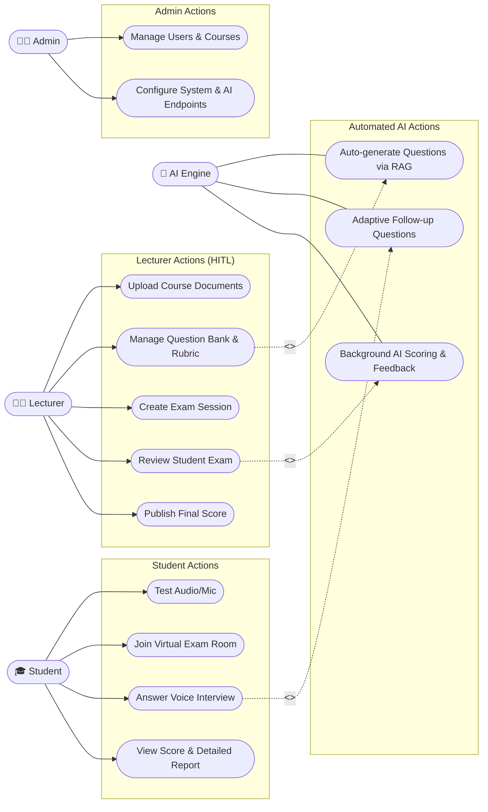

# Use Case Diagram

## 1. Use Case Diagram (Mermaid Flowchart)

---

## 2. List of Actors

1. **Student**: The examinee participating in the viva exam. The primary interaction is voice-based examination.
2. **Lecturer**: The person responsible for academic content, managing exams, grading, and reviewing results (Human-in-the-Loop).
3. **Admin**: The person in charge of the system, configuring users and API connections.
4. **AI Engine**: The automated assistant agent that supports question generation, real-time follow-up questions, and automated background grading.

---

## 3. Use Case Descriptions

| Use Case Name | Primary Actor | Brief Description |
| :--- | :--- | :--- |
| **Manage Question Bank & Rubric** | Lecturer | The lecturer reviews questions and grading criteria generated manually or suggested by AI. |
| **Auto-generate Questions via RAG** | AI Engine | (*Included*) AI reads uploaded course materials to extract and generate multiple-choice / essay questions. |
| **Join Virtual Exam Room** | Student | The examinee connects to the exam room to interact directly with the AI Examiner. |
| **Answer Voice Interview** | Student | The examinee uses a microphone to answer questions prompted by the AI. |
| **Adaptive Follow-up Questions** | AI Engine | (*Included*) If the examinee's answer is incomplete, the AI automatically generates follow-up questions to clarify points in real-time. |
| **Review Student Exam** | Lecturer | After the exam session ends, the lecturer listens to/reads the transcript and reviews the score suggested by the AI. |
| **Background AI Scoring & Feedback** | AI Engine | (*Included*) Background processing: Matches the student's transcript against the Rubric to output a score and rationale. |
| **Publish Final Score** | Lecturer | The final decision (HITL), locking the score and publishing the results for the student to view. |
